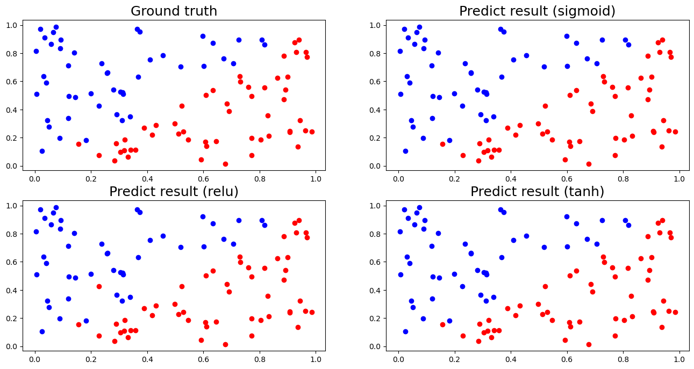

# Lab1: back-propagation Report

> student id: 313551097<br>
> student name: 鄭淮薰

## 1. Introduction

In this lab, I implement simple neural networks with two hidden layers to make predictions on linear and XOR data.

|          Linear Data           |         XOR Data         |
| :----------------------------: | :----------------------: |
|  |  |

## 2. Experiment setups

### A. Sigmoid functions

I use the sigmoid function as the activation function in our model. The function is defined as follows:

- `deriv`: Default is `False`. Set this to `True` if you want to get the derivative of the sigmoid function.

```py
def sigmoid(x, deriv=False):
    if deriv is True:
        return x * (1 - x)
    return 1 / (1 + np.exp(-x))
```

### B. Neural network

I design my neural network as below:

- 1 input layer with 2 neurals
- 2 hidden layer with 4 neurals
- 1 output layer with 1 neurals


### C. Backpropagation

**(a) Update output layer weights**

```math
\text{Let Loss = MSE Loss} = \frac{1}{N}\sum_{i=1}^{N}(Y_i-\hat{Y_i})\\
```

$$
\begin{align*}
\frac{\partial{Loss}}{\partial{w_3}}&=\frac{\partial{Loss}}{\partial{\hat Y}} \cdot \frac{\partial{\hat Y}}{\partial{z_3}} \cdot \frac{\partial{z_3}}{\partial{w_3}} \\
&= -(Y-\hat Y) \cdot \sigma'(\hat Y) \cdot x\\
&= \text{error} \cdot \sigma'(\hat Y) \cdot x\\
&= \text{delta }_3 \cdot x

\end{align*}
$$

- $\hat Y$ = $\sigma(z_3)$ = prediction
- $z_3$ = $x$ \* $w_3$
- $x$: output layer input = hidden layer output

Note:

> Originally,
> $$\frac{\partial{Loss}}{\partial{\hat Y}} = \frac{-2}{N}(Y-\hat Y)$$
> Since the weight update can be adjusted through the learning rate, we directly use $-(Y - \hat Y)$ as the error

---

**(b) Update hidden layer weights**

$$
\begin{align*}
\frac{\partial{Loss}}{\partial{w_i}}&=\frac{\partial{Loss}}{\partial{y}} \cdot \frac{\partial{y}}{\partial{z_i}} \cdot \frac{\partial{z_i}}{\partial{w_i}} \\
&= ( \text{delta }_{i+1} \cdot w_{i+1} ) \cdot \sigma'(y) \cdot x\\
&= \text{delta }_{i} \cdot x

\end{align*}
$$

- $y =\sigma(z_i) = \text{hidden layer}_i \text{ output}$
- $z_i$ = $x$ \* $w_i$
- $x$: $\text{hidden layer}_i \text{ input}$ = $\text{hidden layer}_{i-1} \text{ output}$

## 3. Results of your testing

My default hyperparameter settings are as follows:

```yaml
input size: 2
output size: 1
hidden layer: 2
number of units: [4, 4]
learning rate: 0.001
activation function: sigmoid
```

### A. Screenshot and comparison figure

Below table shows the training loss details for Linear Data and XOR Data. The graphs indicate a gradual decrease in loss with increasing training iterations

|            Linear Data Training Loss            |          XOR Data Training Loss           |
| :---------------------------------------------: | :---------------------------------------: |
|  |  |

|          Linear Data Comparsion Figure          |
| :---------------------------------------------: |
|  |

|        XOR Data Comparsion Figure         |
| :---------------------------------------: |
|  |

### B. Show the accuracy of your prediction

**Linear Data Testing Result**

```
--------------- Testing -----------------
Iter0 |	Ground truth: 1 |	 prediction: 0.9939461169329532 |
Iter1 |	Ground truth: 0 |	 prediction: 0.019498171984910516 |
Iter2 |	Ground truth: 0 |	 prediction: 0.022140901428855792 |
Iter3 |	Ground truth: 1 |	 prediction: 0.9960516111256087 |
Iter4 |	Ground truth: 1 |	 prediction: 0.9729721176104039 |
Iter5 |	Ground truth: 1 |	 prediction: 0.9955456228348912 |
Iter6 |	Ground truth: 0 |	 prediction: 0.007812602373142078 |
Iter7 |	Ground truth: 1 |	 prediction: 0.9788665682241294 |
Iter8 |	Ground truth: 1 |	 prediction: 0.9828912742408821 |
Iter9 |	Ground truth: 0 |	 prediction: 0.02346575344179707 |
Iter10 |	Ground truth: 0 |	 prediction: 0.007935001761431503 |
Iter11 |	Ground truth: 1 |	 prediction: 0.9790678130751764 |
Iter12 |	Ground truth: 1 |	 prediction: 0.9867941033907089 |
Iter13 |	Ground truth: 1 |	 prediction: 0.9867741347618542 |
Iter14 |	Ground truth: 0 |	 prediction: 0.006830119777485916 |
Iter15 |	Ground truth: 0 |	 prediction: 0.012543688114048789 |
Iter16 |	Ground truth: 1 |	 prediction: 0.9959404296526478 |
Iter17 |	Ground truth: 0 |	 prediction: 0.023256543071619618 |
Iter18 |	Ground truth: 0 |	 prediction: 0.014095732901245392 |
Iter19 |	Ground truth: 0 |	 prediction: 0.02079875527199317 |
Iter20 |	Ground truth: 1 |	 prediction: 0.9897140429469323 |
Iter21 |	Ground truth: 1 |	 prediction: 0.9940997607483704 |
Iter22 |	Ground truth: 1 |	 prediction: 0.984568398058101 |
Iter23 |	Ground truth: 1 |	 prediction: 0.9815616476508398 |
Iter24 |	Ground truth: 0 |	 prediction: 0.013696766371764927 |
Iter25 |	Ground truth: 0 |	 prediction: 0.017471969082237974 |
Iter26 |	Ground truth: 0 |	 prediction: 0.023382267813385368 |
Iter27 |	Ground truth: 1 |	 prediction: 0.9889533323246293 |
Iter28 |	Ground truth: 1 |	 prediction: 0.9781566457589602 |
Iter29 |	Ground truth: 1 |	 prediction: 0.9841168493742452 |
Iter30 |	Ground truth: 0 |	 prediction: 0.014486828848472303 |
Iter31 |	Ground truth: 0 |	 prediction: 0.009824079952096713 |
Iter32 |	Ground truth: 1 |	 prediction: 0.9785095623643185 |
Iter33 |	Ground truth: 1 |	 prediction: 0.9940063990410427 |
Iter34 |	Ground truth: 1 |	 prediction: 0.9955558042566734 |
Iter35 |	Ground truth: 0 |	 prediction: 0.00691277391095639 |
Iter36 |	Ground truth: 1 |	 prediction: 0.9958678317144338 |
Iter37 |	Ground truth: 1 |	 prediction: 0.9744063448143195 |
Iter38 |	Ground truth: 0 |	 prediction: 0.004902785899219146 |
Iter39 |	Ground truth: 0 |	 prediction: 0.020631792921646314 |
Iter40 |	Ground truth: 0 |	 prediction: 0.017363296190153855 |
Iter41 |	Ground truth: 0 |	 prediction: 0.011508458155303247 |
Iter42 |	Ground truth: 1 |	 prediction: 0.9702983616430918 |
Iter43 |	Ground truth: 0 |	 prediction: 0.02016619989118534 |
Iter44 |	Ground truth: 0 |	 prediction: 0.015471901906790084 |
Iter45 |	Ground truth: 1 |	 prediction: 0.9912242686233269 |
Iter46 |	Ground truth: 0 |	 prediction: 0.02193374570716886 |
Iter47 |	Ground truth: 0 |	 prediction: 0.010769174814348408 |
Iter48 |	Ground truth: 0 |	 prediction: 0.02596297473519324 |
Iter49 |	Ground truth: 1 |	 prediction: 0.9709617836962681 |
Iter50 |	Ground truth: 1 |	 prediction: 0.9891411677073495 |
Iter51 |	Ground truth: 1 |	 prediction: 0.9801097961534737 |
Iter52 |	Ground truth: 0 |	 prediction: 0.007457602844580244 |
Iter53 |	Ground truth: 1 |	 prediction: 0.9871575569242546 |
Iter54 |	Ground truth: 0 |	 prediction: 0.02063744347142687 |
Iter55 |	Ground truth: 0 |	 prediction: 0.01425970379658852 |
Iter56 |	Ground truth: 0 |	 prediction: 0.0237393853114027 |
Iter57 |	Ground truth: 1 |	 prediction: 0.986061955926702 |
Iter58 |	Ground truth: 0 |	 prediction: 0.006529739883375829 |
Iter59 |	Ground truth: 0 |	 prediction: 0.013331925675737493 |
Iter60 |	Ground truth: 1 |	 prediction: 0.9725792507202315 |
Iter61 |	Ground truth: 0 |	 prediction: 0.011279385952341575 |
Iter62 |	Ground truth: 1 |	 prediction: 0.976550936543229 |
Iter63 |	Ground truth: 1 |	 prediction: 0.9757786186000061 |
Iter64 |	Ground truth: 1 |	 prediction: 0.9925181070843809 |
Iter65 |	Ground truth: 0 |	 prediction: 0.02332025578541211 |
Iter66 |	Ground truth: 1 |	 prediction: 0.9786007984851328 |
Iter67 |	Ground truth: 0 |	 prediction: 0.00522301139017472 |
Iter68 |	Ground truth: 1 |	 prediction: 0.9805643095942146 |
Iter69 |	Ground truth: 1 |	 prediction: 0.9885587069831041 |
Iter70 |	Ground truth: 0 |	 prediction: 0.010412245425339115 |
Iter71 |	Ground truth: 0 |	 prediction: 0.025059033323686777 |
Iter72 |	Ground truth: 0 |	 prediction: 0.017153072224171433 |
Iter73 |	Ground truth: 0 |	 prediction: 0.018472861043693816 |
Iter74 |	Ground truth: 1 |	 prediction: 0.9848294394376514 |
Iter75 |	Ground truth: 0 |	 prediction: 0.006428967600982381 |
Iter76 |	Ground truth: 1 |	 prediction: 0.9811847299828698 |
Iter77 |	Ground truth: 0 |	 prediction: 0.007295866185476083 |
Iter78 |	Ground truth: 1 |	 prediction: 0.9787200371102449 |
Iter79 |	Ground truth: 1 |	 prediction: 0.9908292731189025 |
Iter80 |	Ground truth: 1 |	 prediction: 0.9794234283935913 |
Iter81 |	Ground truth: 0 |	 prediction: 0.021892515000262652 |
Iter82 |	Ground truth: 1 |	 prediction: 0.9920693548594719 |
Iter83 |	Ground truth: 0 |	 prediction: 0.023151387364514827 |
Iter84 |	Ground truth: 1 |	 prediction: 0.9921447693458559 |
Iter85 |	Ground truth: 0 |	 prediction: 0.008035177559093033 |
Iter86 |	Ground truth: 0 |	 prediction: 0.011114782712302516 |
Iter87 |	Ground truth: 0 |	 prediction: 0.011826589583454589 |
Iter88 |	Ground truth: 0 |	 prediction: 0.015872018857173677 |
Iter89 |	Ground truth: 0 |	 prediction: 0.006866334718863017 |
Iter90 |	Ground truth: 0 |	 prediction: 0.013178646558339521 |
Iter91 |	Ground truth: 0 |	 prediction: 0.02128772497737386 |
Iter92 |	Ground truth: 1 |	 prediction: 0.9901188620141761 |
Iter93 |	Ground truth: 0 |	 prediction: 0.017216952523878244 |
Iter94 |	Ground truth: 0 |	 prediction: 0.013184930592596946 |
Iter95 |	Ground truth: 1 |	 prediction: 0.9951824693868992 |
Iter96 |	Ground truth: 0 |	 prediction: 0.01316553155274501 |
Iter97 |	Ground truth: 1 |	 prediction: 0.9690601784203873 |
Iter98 |	Ground truth: 1 |	 prediction: 0.9779000558731297 |
Iter99 |	Ground truth: 0 |	 prediction: 0.020709119744858864 |
loss: 0.00028018345753535247 accuracy: 1.0
```

**XOR Data Testing Result**

```
--------------- Testing -----------------
Iter0 |	Ground truth: 0 |	 prediction: 0.0818790680280117 |
Iter1 |	Ground truth: 1 |	 prediction: 0.9138994319826581 |
Iter2 |	Ground truth: 0 |	 prediction: 0.07827978710234437 |
Iter3 |	Ground truth: 1 |	 prediction: 0.9171885246611613 |
Iter4 |	Ground truth: 0 |	 prediction: 0.08076013807234844 |
Iter5 |	Ground truth: 1 |	 prediction: 0.9150323170237324 |
Iter6 |	Ground truth: 0 |	 prediction: 0.08085082981800332 |
Iter7 |	Ground truth: 1 |	 prediction: 0.9164180738557776 |
Iter8 |	Ground truth: 0 |	 prediction: 0.07877319055723003 |
Iter9 |	Ground truth: 1 |	 prediction: 0.9167248014653304 |
Iter10 |	Ground truth: 0 |	 prediction: 0.08158325684733106 |
Iter11 |	Ground truth: 0 |	 prediction: 0.08052484052830743 |
Iter12 |	Ground truth: 1 |	 prediction: 0.9148905730347217 |
Iter13 |	Ground truth: 0 |	 prediction: 0.08061296478757005 |
Iter14 |	Ground truth: 1 |	 prediction: 0.9147178763551149 |
Iter15 |	Ground truth: 0 |	 prediction: 0.07756021138504776 |
Iter16 |	Ground truth: 1 |	 prediction: 0.9139412318923497 |
Iter17 |	Ground truth: 0 |	 prediction: 0.07971382551433648 |
Iter18 |	Ground truth: 1 |	 prediction: 0.9161762585759353 |
Iter19 |	Ground truth: 0 |	 prediction: 0.08049248374558621 |
Iter20 |	Ground truth: 1 |	 prediction: 0.9165583039740662 |
loss: 0.006757456314558341 accuracy: 1.0
```

### C. Learning curve (loss, epoch curve)

|                       Linear Data                       |                     XOR Data                      |
| :-----------------------------------------------------: | :-----------------------------------------------: |
|  |  |

## 4. Discussion

### A. Try different learning rates

After trying different learning rates (0.1, 0.001, 0.00001) on linear data and XOR data, I found that the model can converge faster only at 0.1 and 0.001. When the learning rate is as small as 0.00001, the convergence speed drops significantly. After the same run 100000 times, the accuracy of the model with learning rate 0.00001 is only 0.64

**Linear Data**

```
--------------- Training (lr = 0.1) ----------------
epoch 0 loss : 0.45599896928312283
epoch 5000 loss : 4.320634044442202e-05
epoch 10000 loss : 1.8251989314119764e-05
(... omit ...)
epoch 85000 loss : 1.5760734583698257e-06
epoch 90000 loss : 1.4796703948832626e-06
epoch 95000 loss : 1.3940112169997821e-06
epoch 100000 loss : 1.3174156834334252e-06
--------------- Testing (lr = 0.1) -----------------
loss: 1.317401176225008e-06 accuracy: 1.0

--------------- Training (lr = 0.01) ----------------
epoch 0 loss : 0.37114787397879895
epoch 5000 loss : 0.0013433714570010142
epoch 10000 loss : 0.000381110029301757
(... omit ...)
epoch 85000 loss : 2.1927162182262596e-05
epoch 90000 loss : 2.0489556773891182e-05
epoch 95000 loss : 1.9220417002862944e-05
epoch 100000 loss : 1.809227874289594e-05
--------------- Testing (lr = 0.01) -----------------
loss: 1.809206568215741e-05 accuracy: 1.0

--------------- Training (lr = 1e-05) ----------------
epoch 0 loss : 0.4020276415284238
epoch 5000 loss : 0.3384528581574242
epoch 10000 loss : 0.2846233852256547
(... omit ...)
epoch 80000 loss : 0.2355595686450437
epoch 85000 loss : 0.2341272354165785
epoch 90000 loss : 0.23270339370759177
epoch 95000 loss : 0.23128803794665362
epoch 100000 loss : 0.2298811616574733
--------------- Testing (lr = 1e-05) -----------------
loss: 0.2298808811298553 accuracy: 0.64
```


**XOR Data**

```
--------------- Training (lr = 0.1) ----------------
epoch 0 loss : 0.3804829534648606
epoch 5000 loss : 0.0007448047195999679
epoch 10000 loss : 0.00028983087843161167
(... omit ...)
epoch 85000 loss : 1.7838092117611263e-05
epoch 90000 loss : 1.6621254806293085e-05
epoch 95000 loss : 1.55493484146926e-05
epoch 100000 loss : 1.4598596042416046e-05
--------------- Testing (lr = 0.1) -----------------
loss: 1.4598416680140832e-05 accuracy: 1.0

--------------- Training (lr = 0.01) ----------------
epoch 0 loss : 0.3537853150184201
epoch 5000 loss : 0.013871069828825203
epoch 10000 loss : 0.005646337963716397
(... omit ...)
epoch 85000 loss : 0.0003095062775592248
epoch 90000 loss : 0.0002869339394255435
epoch 95000 loss : 0.00026715905502172247
epoch 100000 loss : 0.0002497107912001567
--------------- Testing (lr = 0.01) -----------------
loss: 0.00024970750801619937 accuracy: 1.0

--------------- Training (lr = 1e-05) ----------------
epoch 0 loss : 0.4316682865648443
epoch 5000 loss : 0.42081247573928604
epoch 10000 loss : 0.408056045091267
(... omit ...)
epoch 85000 loss : 0.21757242252191794
epoch 90000 loss : 0.21559210909490775
epoch 95000 loss : 0.21386826184639332
epoch 100000 loss : 0.21231334789598227
--------------- Testing (lr = 1e-05) -----------------
loss: 0.21231304960531444 accuracy: 0.7619047619047619

```


### B. Try different numbers of hidden units

The accuracy for all different hidden units([[1, 1], [2,3], [3,2], [5,5]]) was 1.0.

**Linear Data**

```
--------------- Training (units = [1, 1]) ----------------
epoch 0 loss : 0.2913017360886822
epoch 5000 loss : 0.1380194924451806
epoch 10000 loss : 0.08225983810929943
(... omit ...)
epoch 85000 loss : 0.0036700816813601085
epoch 90000 loss : 0.0033830766431555198
epoch 95000 loss : 0.003137694338473655
epoch 100000 loss : 0.0029256486364144544
--------------- Testing (units = [1, 1]) -----------------
loss: 0.002925609116475216 accuracy: 1.0

--------------- Training (units = [2, 3]) ----------------
epoch 0 loss : 0.37330878576784826
epoch 5000 loss : 0.15063292019881253
(... omit ...)
epoch 85000 loss : 0.000452371061424244
epoch 90000 loss : 0.00040818277693599155
epoch 95000 loss : 0.000371099649107606
epoch 100000 loss : 0.00033960476328561177
--------------- Testing (units = [2, 3]) -----------------
loss: 0.00033959894305990223 accuracy: 1.0

--------------- Training (units = [3, 2]) ----------------
epoch 0 loss : 0.34886220127043843
epoch 5000 loss : 0.13893618052399093
epoch 10000 loss : 0.08185292119694829
(... omit ...)
epoch 85000 loss : 0.0009479631531298957
epoch 90000 loss : 0.0008451765905453667
epoch 95000 loss : 0.0007598999442209117
epoch 100000 loss : 0.0006882632199806437
--------------- Testing (units = [3, 2]) -----------------
loss: 0.0006882500534448362 accuracy: 1.0

--------------- Training (units = [5, 5]) ----------------
epoch 0 loss : 0.463433616418641
epoch 5000 loss : 0.138329898267319
epoch 10000 loss : 0.08387266732455778
(... omit ...)
epoch 85000 loss : 0.001412559840960632
epoch 90000 loss : 0.0012305484065730295
epoch 95000 loss : 0.0010832254015041003
epoch 100000 loss : 0.0009623069854353422
--------------- Testing (units = [5, 5]) -----------------
loss: 0.0009622850137068985 accuracy: 1.0

--------------- Training (units = [10, 10]) ----------------
epoch 0 loss : 0.5256359626283807
epoch 5000 loss : 0.14340534374031536
(... omit ...)
epoch 85000 loss : 0.00800206334997572
epoch 90000 loss : 0.0074633730326345085
epoch 95000 loss : 0.0069811611806115505
epoch 100000 loss : 0.0065454732153832585
--------------- Testing (units = [10, 10]) -----------------
loss: 0.006545390170042321 accuracy: 1.0
```


**XOR Data**

```
--------------- Training (units = [1, 1]) ----------------
epoch 0 loss : 0.29661281586094845
epoch 5000 loss : 0.14191452046549444
epoch 10000 loss : 0.08597904609259586
(... omit ...)
epoch 85000 loss : 0.007932308494340932
epoch 90000 loss : 0.007421733829948164
epoch 95000 loss : 0.006969854435417901
epoch 100000 loss : 0.00656731314147228
--------------- Testing (units = [1, 1]) -----------------
loss: 0.006567237041995181 accuracy: 1.0

--------------- Training (units = [2, 3]) ----------------
epoch 0 loss : 0.40011737654768387
epoch 5000 loss : 0.15145922139864343
epoch 10000 loss : 0.08939350069445895
(... omit ...)
epoch 85000 loss : 0.00548912655301065
epoch 90000 loss : 0.005038072728434092
epoch 95000 loss : 0.004645786641372131
epoch 100000 loss : 0.004302222803760326
--------------- Testing (units = [2, 3]) -----------------
loss: 0.004302158403609181 accuracy: 1.0

--------------- Training (units = [3, 2]) ----------------
epoch 0 loss : 0.2538294227276841
epoch 5000 loss : 0.13215858704500544
epoch 10000 loss : 0.08140828387433487
(... omit ...)
epoch 85000 loss : 0.007806051940896662
epoch 90000 loss : 0.00729733361759516
epoch 95000 loss : 0.006846314467809185
epoch 100000 loss : 0.006443882508481824
--------------- Testing (units = [3, 2]) -----------------
loss: 0.006443806368819212 accuracy: 1.0

--------------- Training (units = [5, 5]) ----------------
epoch 0 loss : 0.4513278746283466
epoch 5000 loss : 0.14900058248650794
epoch 10000 loss : 0.08971238959982476
(... omit ...)
epoch 90000 loss : 0.007555296403730484
epoch 95000 loss : 0.007092096984175421
epoch 100000 loss : 0.006679481908812653
--------------- Testing (units = [5, 5]) -----------------
loss: 0.006679403904258315 accuracy: 1.0

--------------- Training (units = [10, 10]) ----------------
epoch 0 loss : 0.5208087521516216
epoch 5000 loss : 0.2338729653563362
(... omit ...)
epoch 85000 loss : 0.008658548484490703
epoch 90000 loss : 0.008078833819585414
epoch 95000 loss : 0.007568731897977316
epoch 100000 loss : 0.007116674800542488
--------------- Testing (units = [10, 10]) -----------------
loss: 0.007116589549580911 accuracy: 1.0
```


### C. Try without activation functions

We can find from the experimental results below that the model can still converge without the activation function, and even non-linear XOR Data accuracy can reach 1.0. I think this is because the network takes the form of 2 hidden layers, so that for simple data sets, an effective linear segmentation can still be found to achieve high accuracy

**Linear Data**

```
--------------- Training (function = sigmoid) ----------------
epoch 0 loss : 0.37100642832424696
epoch 5000 loss : 0.1466105965089553
epoch 10000 loss : 0.08828685401483609
(... omit ...)
epoch 85000 loss : 0.0016556364129101217
epoch 90000 loss : 0.0013908714499662786
epoch 95000 loss : 0.0011860135584190138
epoch 100000 loss : 0.0010246569863938718
--------------- Testing (function = sigmoid) -----------------
loss: 0.0010246282453070068 accuracy: 1.0

--------------- Training (function = without_activation) ----------------
epoch 0 loss : 33.489116284046865
epoch 5000 loss : 2.4638098495953564e-10
epoch 10000 loss : 3.1365975254629415e-19
(... omit ...)
epoch 85000 loss : 3.057975129089684e-28
epoch 90000 loss : 3.0578811437083977e-28
epoch 95000 loss : 3.057817048759849e-28
epoch 100000 loss : 3.05777544867305e-28
--------------- Testing (function = without_activation) -----------------
loss: 3.05777544867305e-28 accuracy: 1.0

```


**XOR Data**

```
--------------- Training (function = sigmoid) ----------------
epoch 0 loss : 0.3331684039256011
epoch 5000 loss : 0.14448072672473233
epoch 10000 loss : 0.08708821377441665
(... omit ...)
epoch 85000 loss : 0.006498829241651059
epoch 90000 loss : 0.006001256438253078
epoch 95000 loss : 0.005564774154383067
epoch 100000 loss : 0.005179350168118591
--------------- Testing (function = sigmoid) -----------------
loss: 0.005179277627667562 accuracy: 1.0

--------------- Training (function = without_activation) ----------------
epoch 0 loss : 26.854628916081463
epoch 5000 loss : 7.016936775040677e-11
epoch 10000 loss : 9.674111840509694e-21
(... omit ...)
epoch 90000 loss : 2.2032171067223716e-28
epoch 95000 loss : 2.2121857039186343e-28
epoch 100000 loss : 2.2089868259919567e-28
--------------- Testing (function = without_activation) -----------------
loss: 2.207636840811891e-28 accuracy: 1.0

```


## 5. Extra

### A. Implement different optimizers

During the training process, I found that the learning rate η is very important. If it is too large, it may cause the rate to be too unstable and unable to learn correctly, while if it is too small, it will take too much time to learn, or even get stuck in the local minimum. Therefore, I tried to use AdaGrad to adjust the learning rate η according to the gradient for optimization. The formula is as follows:

$$
W' = W - η \frac{1}{\sqrt{n+\epsilon}}\frac{\partial L}{\partial W}\\
$$

$$
n = \sum(\frac{\partial L}{\partial W})^2
$$

where $n$ is the sum of all gradient values

```py
class AdaGrad:
    def __init__(self, weights, biases, epsilon=1e-8):
        self.epsilon = epsilon
        self.dw_squared = [np.zeros_like(p) for p in weights]
        self.db_squared = [np.zeros_like(p) for p in biases]

    def update(self, weights, biases, grads, lr=0.001):
        dw, db = grads
        for i in range(1, len(weights)):
            self.dw_squared[i] += dw[i]**2
            self.db_squared[i] += db[i]**2

            weights[i] -= lr * dw[i] / (np.sqrt(self.dw_squared[i]) + self.epsilon)
            biases[i] -= lr * db[i] / (np.sqrt(self.db_squared[i]) + self.epsilon)
        return weights, biases
```

**Linear Data**

```
--------------- Training (optimizer = None) ----------------
epoch 0 loss : 0.41555388376944363
epoch 5000 loss : 0.35039922758271375
epoch 10000 loss : 0.28686493438789673
(... omit ...)
epoch 85000 loss : 0.23148458174502629
epoch 90000 loss : 0.23007835878931274
epoch 95000 loss : 0.22868017872079582
epoch 100000 loss : 0.22729004570096328
--------------- Testing (optimizer = None) -----------------
loss: 0.2272897684794387 accuracy: 0.59

--------------- Training (optimizer = AdaGrad) ----------------
epoch 0 loss : 0.4092253690624459
epoch 5000 loss : 0.32240766847425706
epoch 10000 loss : 0.2827789239123336
(... omit ...)
epoch 90000 loss : 0.11779468286092928
epoch 95000 loss : 0.11443195305908334
epoch 100000 loss : 0.11125206368766373
--------------- Testing (optimizer = AdaGrad) -----------------
loss: 0.11125144393138868 accuracy: 1.0
```


**XOR Data**

```
--------------- Training (optimizer = None) ----------------
epoch 0 loss : 0.34777291426929535
epoch 5000 loss : 0.3281181324708059
epoch 10000 loss : 0.30853855549039266
(... omit ...)
epoch 85000 loss : 0.21267638386809673
epoch 90000 loss : 0.211324971964455
epoch 95000 loss : 0.2100117639316098
epoch 100000 loss : 0.20872623037041965
--------------- Testing (optimizer = None) -----------------
loss: 0.20872597552320157 accuracy: 0.7142857142857143

--------------- Training (optimizer = AdaGrad) ----------------
epoch 0 loss : 0.456393073061316
epoch 5000 loss : 0.3869066690434124
(... omit ...)
epoch 85000 loss : 0.12496341816674163
epoch 90000 loss : 0.12040314465475509
epoch 95000 loss : 0.11623043772411228
epoch 100000 loss : 0.11239240507125407
--------------- Testing (optimizer = AdaGrad) -----------------
loss: 0.11239166785295776 accuracy: 1.0
```


### B. Implement different activation functions

Implement relu, tanh and their derivatives for back propagations

```py
# relu function
def relu(x, deriv=False):
    if deriv is True:
        return np.where(x > 0, 1, 0)
    return np.maximum(0, x)
```

```py
# tanh function
def tanh(x, deriv=False):
    if deriv is True:
        return 1.0 - x**2
    return (np.exp(x) - np.exp(-x)) / (np.exp(x) + np.exp(-x))
```

From the results, we know that the accuracy for all activation function (sigmoid, relu and tanh) was close to 1.0.

**Linear Data**

```
--------------- Training (function = sigmoid) ----------------
epoch 0 loss : 0.46123434996506774
epoch 5000 loss : 0.23607290427820524
epoch 10000 loss : 0.222172350842553
(... omit ...)
epoch 80000 loss : 0.10197370290902834
epoch 85000 loss : 0.09724198276065547
epoch 90000 loss : 0.09283781964428602
epoch 95000 loss : 0.08873448637116008
epoch 100000 loss : 0.08490741651235437
--------------- Testing (function = sigmoid) -----------------
loss: 0.08490667719560294 accuracy: 1.0

--------------- Training (function = relu) ----------------
epoch 0 loss : 36.09606409646874
epoch 5000 loss : 0.02639260851857662
epoch 10000 loss : 0.010550614432822935
epoch 15000 loss : 0.010017070141519873
epoch 20000 loss : 0.010000544671658626
(... omit ...)
epoch 80000 loss : 0.01
epoch 85000 loss : 0.01
epoch 90000 loss : 0.01
epoch 95000 loss : 0.01
epoch 100000 loss : 0.01
--------------- Testing (function = relu) -----------------
loss: 0.01 accuracy: 0.99

--------------- Training (function = tanh) ----------------
epoch 0 loss : 0.4915604421369029
epoch 5000 loss : 0.17591759353884492
epoch 10000 loss : 0.10435066515527891
(... omit ...)
epoch 90000 loss : 0.0015807860566855439
epoch 95000 loss : 0.0013902728994575066
epoch 100000 loss : 0.0012315462585508318
--------------- Testing (function = tanh) -----------------
loss: 0.0012315172358652242 accuracy: 1.0

```




**XOR Data**

```
--------------- Training (function = sigmoid) ----------------
epoch 0 loss : 0.41465597993311737
epoch 5000 loss : 0.26888188574026717
epoch 10000 loss : 0.22216885682795592
epoch 15000 loss : 0.20823893796577894
epoch 20000 loss : 0.19610050400485374
e(... omit ...)
epoch 95000 loss : 0.08832263000215208
epoch 100000 loss : 0.08449481918771337
--------------- Testing (function = sigmoid) -----------------
loss: 0.0844940797918752 accuracy: 1.0

--------------- Training (function = relu) ----------------
epoch 0 loss : 26.8293879381748
epoch 5000 loss : 0.10384606312302849
epoch 10000 loss : 0.058687024575527
epoch 15000 loss : 0.04960643692148542
(... omit ...)
epoch 90000 loss : 0.047619047619071396
epoch 95000 loss : 0.04761904761905213
epoch 100000 loss : 0.04761904761904846
--------------- Testing (function = relu) -----------------
loss: 0.04761904761904846 accuracy: 0.9523809523809523

--------------- Training (function = tanh) ----------------
epoch 0 loss : 0.4920549513217177
epoch 5000 loss : 0.19945104219723028
epoch 10000 loss : 0.10536944335995264
(... omit ...)
epoch 90000 loss : 0.000973644904936838
epoch 95000 loss : 0.0008979450976710528
epoch 100000 loss : 0.0008324604278263105
--------------- Testing (function = tanh) -----------------
loss: 0.0008324482191524029 accuracy: 1.0

```


### C. Implement convolutional layers
