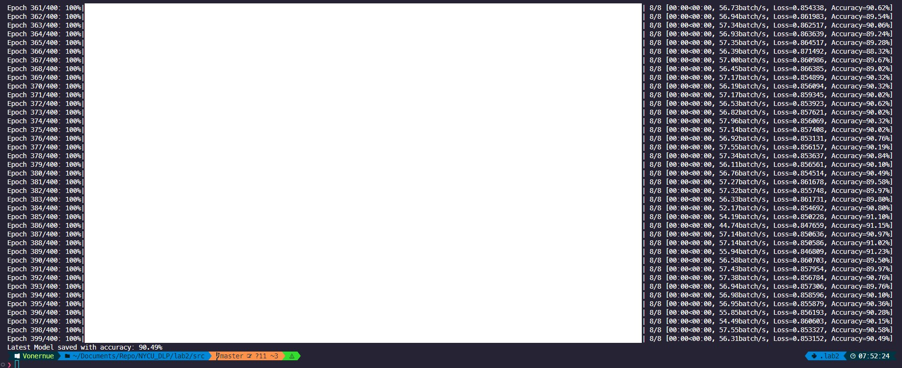
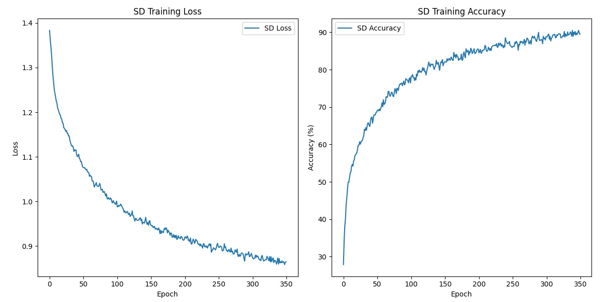
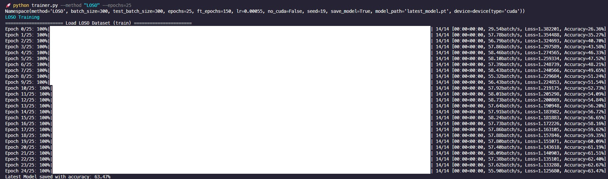
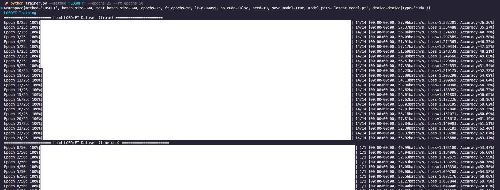
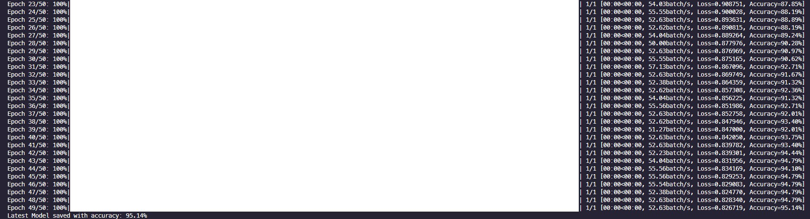
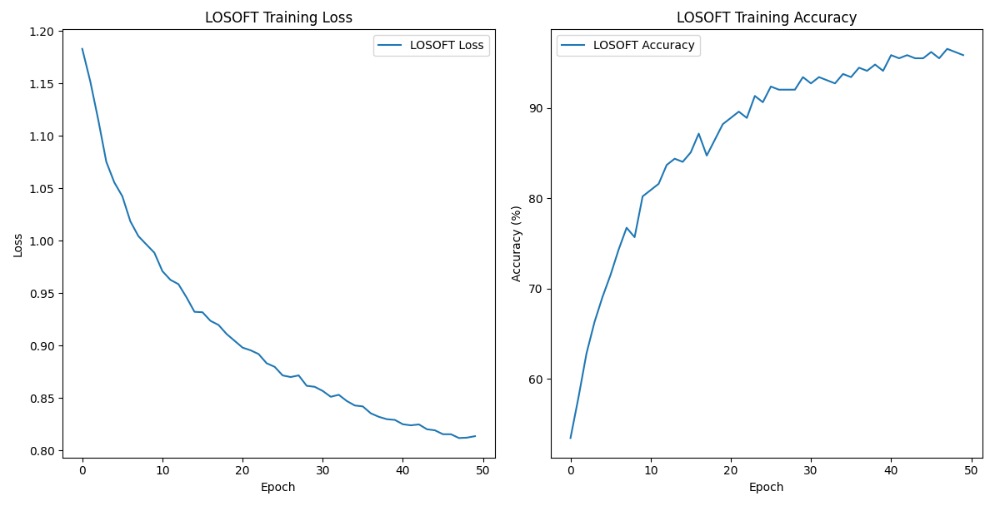
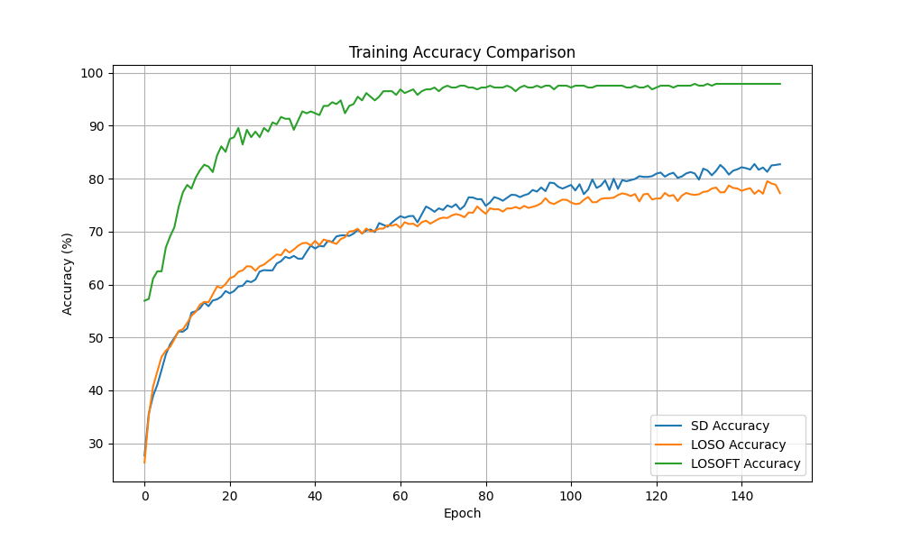

# Lab2: EEG Motor Imagery Classification

> student id: 313551097<br>
> student name: 鄭淮薰

## I. Overview

In this lab, I implement SCCNet and three differennt methods, subject dependent, leave-one-subject-out, and LOSO with fine tuning, to predict motor imagery task.

## II. Implementation Details

### A. Details of training and testing code

#### Training

The `train()` function performs model training for multiple epochs based on the specified `data` `optimizer` `criterion`. Each epoch training will perform steps such as forward, backward, optimize and loss calculation in sequence.

```py
def train(model, device, train_loader, optimizer, criterion, epochs):
    history = {'loss': [], 'accuracy': []}
    for epoch in range(epochs):
        with tqdm(total=len(train_loader), desc=f"Epoch {epoch}/{epochs}",
                    unit="batch", leave=True) as pbar:
            model.train()
            running_loss = 0.0
            correct = 0
            total = 0

            for data, target in train_loader:
                data, target = data.to(device), target.to(device)
                optimizer.zero_grad()
                output = model(data)
                loss = criterion(output, target)
                loss.backward()

                optimizer.step()
                running_loss += loss.item()

                _, predicted = torch.max(output.data, 1)
                total += target.size(0)
                correct += (predicted == target).sum().item()

                pbar.update(1)

            train_acc = 100. * correct / total
            train_loss = running_loss / len(train_loader)

            pbar.set_postfix({'Loss': f'{train_loss:.6f}', \
                                'Accuracy': f'{train_acc:.2f}%'})
            history['loss'].append(train_loss)
            history['accuracy'].append(train_acc)

    return history
```

---

The `main()` function loads the corresponding training data and trains the model according to the specified method.

```py
    print(termcolor.colored(f"{method} Training", "blue"))

    # Load Data
    train_dataset = MIBCI2aDataset(mode='train', method=method)
    train_loader = DataLoader(train_dataset, batch_size=batch_size, shuffle=True)

    # Create Mode
    model = SCCNet(numClasses=4, timeSample=438, Nu=22,
                C=22, Nc=22, Nt=16, dropoutRate=0.5).to(device)

    # Define optimizer and loss function
    criterion = nn.CrossEntropyLoss()
    optimizer = optim.Adam(model.parameters(),
                            lr=learning_rate, weight_decay=1e-4)

    # Training
    history = train(model, device, train_loader, optimizer, criterion, epochs)

    if args.method == 'LOSOFT':
        FT_dataset = MIBCI2aDataset(mode='finetune', method='LOSOFT')
        FT_loader = DataLoader(FT_dataset, batch_size=batch_size, shuffle=True)
        history = train(model, device, FT_loader, optimizer, criterion, args.ft_epochs)

    train_acc = history['accuracy'][-1]
    np.save(f'{method}_history.npy', history)

    # Save Model
    if model and args.save_model:
        torch.save(model.state_dict(), f"{method}_latest_model.pt")
        torch.save(model.state_dict(), "latest_model.pt")
        print('Latest Model saved with accuracy: {:.2f}%'.format(train_acc))
```

We can specify the model and parameters to be trained through parameters:

e.g.

```shell
$ python trainer.py --method "SD" --epochs=400
$ python trainer.py --method "LOSO" --epochs=25
$ python trainer.py --method "LOSOFT" --epochs=25 --ft_epochs=50
```

---

#### Testing

```py
def test(model, device, test_loader, criterion):
    model.eval()
    test_loss = 0.0
    correct = 0
    total = 0
    with torch.no_grad():
        for data, target in test_loader:
            data, target = data.to(device), target.to(device)
            output = model(data)
            test_loss += criterion(output, target).item()
            _, predicted = torch.max(output.data, 1)
            total += target.size(0)
            correct += (predicted == target).sum().item()

    accuracy = 100. * correct / total
    return test_loss / len(test_loader), accuracy
```

```py
if __name__ == '__main__':
    args = get_args()

    # Load Data
    test_dataset = MIBCI2aDataset(mode='test', method=args.method)
    test_loader = DataLoader(test_dataset, shuffle=False)

    # Define Loss Function
    criterion = nn.CrossEntropyLoss()

    # Load model
    print(termcolor.colored(f"Testing {args.model_path}", "blue"))
    model = SCCNet(numClasses=4, timeSample=438, Nu=22,
                   C=22, Nc=22, Nt=16, dropoutRate=0.5).to(args.device)
    model.load_state_dict(torch.load(args.model_path))

    # Show the results
    test_loss, accuracy = test(model, args.device, test_loader, criterion)
    print(termcolor.colored(f'Test Loss: {test_loss:.4f}, \
                            Accuracy: {accuracy:.2f}%', "green"))
```

We can also specify the model and parameters to be tested through parameters:

e.g.

```shell
$ python tester.py --method='SD' --model_path="SD_model.pt"
$ python tester.py --method='LOSO' --model_path="LOSO_model.pt"
$ python tester.py --method='LOSOFT' --model_path="FT_model.pt"
```

### B. Details of the SCCNet

> reference paper: https://ieeexplore.ieee.org/document/8716937

According to the reference paper, the following is the architecture table of my implementation of SCCNet

|   Layer    | Layer type | In channels | Out Channels  | Kernel Size | Activation |       Note        |
| :--------: | :--------: | :---------: | :-----------: | :---------: | :--------: | :---------------: |
|     1      |   Input    |             |               |             |            |  reshape(1,C,T)   |
|            |   Conv2D   |      1      |     C(22)     | (C(22), 1)  |            |                   |
|            | BatchNorm  |             |               |             |            |                   |
|     2      |   Input    |             |               |             |            |                   |
|            |   Conv2D   |    C(22)    |      20       |   (1, 12)   |            |   padding=(0,6)   |
|            | BatchNorm  |             |               |             |            |                   |
|            | Activation |             |               |             |   square   |                   |
|            |  Dropout   |             |               |             |            | dropoutRate = 0.5 |
|            | AvgPool2d  |             |               |   (1,62)    |            |   stride=(1,12)   |
|            | Activation |             |               |             |    log     |                   |
| Classifier |  Flatten   |             |               |             |            |                   |
|            |   Linear   |   20\*31    | numClasses(4) |             |            |     bias=True     |
|            |  Softmax   |             |               |             |            |                   |

```py
class SquareLayer(nn.Module):
    def __init__(self):
        super().__init__()
    def forward(self, x):
        return torch.square(x)

class LogLayer(nn.Module):
    def __init__(self):
        super().__init__()
    def forward(self, x):
        return torch.log(x)
```

```py
class SCCNet(nn.Module):
    def __init__(self, numClasses=4, timeSample=500, Nu=22, C=22, Nc=22, Nt=1, dropoutRate=0.5):
        super(SCCNet, self).__init__()

        # First convolutional block: Spatial component analysis
        self.conv1 = nn.Conv2d(in_channels=1, out_channels=Nu, kernel_size=(C, Nt))
        self.bn1 = nn.BatchNorm2d(Nu)

        # Second convolutional block: Spatio-temporal filtering
        self.conv2 = nn.Conv2d(Nu, out_channels=20, kernel_size=(1, 12), stride=1, padding=(0, 6))
        self.bn2 = nn.BatchNorm2d(20)

        # Dropout Layer
        self.dropout = nn.Dropout(dropoutRate)

        # Pooling layer: Temporal smoothing
        self.pool = nn.AvgPool2d(kernel_size=(1, 62), stride=(1, 12))

        # Activations
        self.square = SquareLayer()
        self.log = LogLayer()

        # Fully connected layer
        self.fc = nn.Linear(20  * 31, numClasses, bias=True)

    def forward(self, x):
        # First convolutional block
        x = self.conv1(x)
        x = self.bn1(x)

        # Second convolutional block
        x = self.conv2(x)
        x = self.bn2(x)

        x = self.square(x)
        x = self.dropout(x)

        # Pooling layer
        x = self.pool(x)
        x = self.log(x)

        # Flatten and fully connected layer
        x = x.view(x.size(0), -1)
        x = self.fc(x)

        return F.softmax(x, dim=1)
```

## III. Analyze on the experiment results

### A. Discover during the training process

After many trainings, I discovered the following phenomena:

- EEG Data is very easy to overfitting during training
- Fine-tuning of parameters and different random values ​​each time will significantly affect the accuracy.

---

The following is the results of the three methods:

#### SD

> Training Accuracy: 90.49%  
> Testing Accuracy: 62%

|           Training            |
| :---------------------------: |
|  |
|        Acc / Loss Plot        |
|          |

#### LOSO

> Training Accuracy: 63.74%  
> Testing Accuracy: 60%

|             Training              |
| :-------------------------------: |
|  |
|          Acc / Loss Plot          |
|              |

#### LOSO with fine tuning

> Training Accuracy: 95.14%  
> Testing Accuracy: 73%

|            Training             |
| :-----------------------------: |
|  |
|  |
|         Acc / Loss Plot         |
|                |

### B. Comparison between the three training methods

**Training Accuracy Comparision**



As can be seen from the above figure, the LOSO Fine-tune method is significantly better than the SD and LOSO methods. This means that individual fine-tuning can greatly improve the accuracy of the model and reduce errors caused by data variability

**Accuracy Comparision**

|  Acc  |   SD   |  LOSO  | LOSO FT |
| :---: | :----: | :----: | :-----: |
| Train | 90.49% | 63.74% | 95.14%  |
| Test  |  62%   |  60%   |   73%   |

From the above table, we can find that on the training data, both SD and LOSO Fine tune achieved high accuracy. However, on the test data set, only LOSO Fine-tune achieved an accuracy of more than 70.

From this we can draw the following conclusions:

1. The LOSO Fine-tune method can effectively improve the generalization ability and adaptability of the model through individual fine-tuning

2. Because the SD method has seen subject data during the training process, there is an overfitting problem and poor generalization ability. This leaves it with a significant gap between training data and test data

3. LOSO is due to lack of test subject data. This makes it more difficult for the model to adequately adapt to the characteristics of a particular subject, resulting in lower accuracy. But because of this, the performance of the LOSO model in the training data set and the test data set is more consistent

## IV. Discussion

### A. What is the reason to make the task hard to achieve high accuracy?

After training, I found that the model is very easy to overfitting. I think it may be that the EEG signals from different subjects and sessions are very different, which makes the model's generalization ability poor. This results in the model being unable to achieve high accuracy on test data.

### B. What can you do to improve the accuracy of this task?

The author added Dropout and L2 when designing the model to reduce the model complexity and solve the overfitting problem. During the training process, I reduced the learning rate to ensure stable convergence of the model, and used the Adam optimizer to improve training efficiency. In addition, I stopped training early at the appropriate time to improve the problem of low accuracy.
