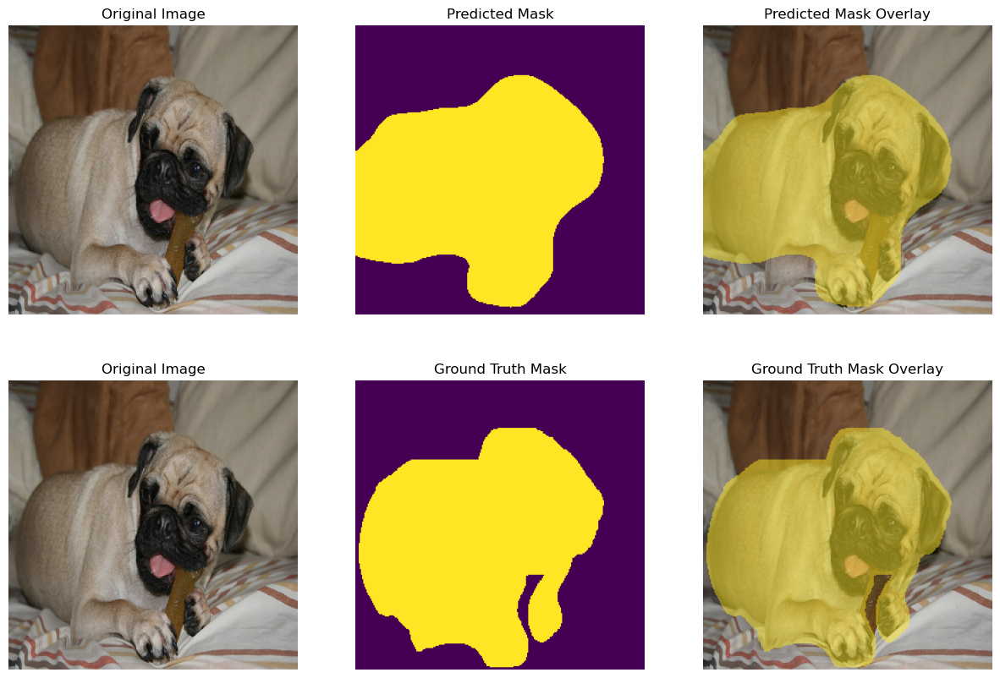

# Lab3: Binary Semantic Segmentation

> student id: 313551097<br>
> student name: 鄭淮薰

## 1. Overview of your lab 3

In lab3, I implemented a binary semantic segmentation model using the UNet and ResNet34_UNet architectures. The model is trained on the Oxford-IIIT Pet Dataset, which contains images of cats and dogs. The goal of the model is to classify each pixel in the image as either a background pixel or a cat/dog pixel. We use the cross-entropy loss function to train the model and the Dice score to evaluate the model's performance. Both the UNet and ResNet34_UNet models achieve a Dice score of around 0.9 on the test set.

## 2. Implementation Details

### A. Details of your training, evaluating, inferencing code

**a. Training**

My training code is split into four main parts:

1. Loading training data and validation data

   I load the training and validation data using the `load_dataset` function, and then create `DataLoader` objects to iterate over the data in batches.

2. Creating the model, loss function, and optimizer

   I create the model using the specified architecture (UNet or ResNet34_UNet). I also choose cross-entropy loss as the loss function and Adam as the optimizer.

3. Training and evaluating the model

   I train the model over multiple epochs, iterating over the training data in batches. For each batch, I compute the output of the model, calculate the loss, and update the model's weights using backpropagation. I also compute the Dice score to evaluate the model's performance on the training data. After each epoch, I evaluate the model on the validation data. Also, if the Dice score on the validation data is higher than 0.99, I will stop training early.

4. Saving the model and logging the results to TensorBoard

   In each epoch, I save the model's weights to a checkpoint file and log the training and validation Dice scores to TensorBoard for visualization.

```py
def train(args):
    data_path = args.data_path
    epochs = args.epochs
    batch_size = args.batch_size
    learning_rate = args.learning_rate
    device = torch.device("cuda" if torch.cuda.is_available() else "cpu")

    best_score = 0.0
    model_name = args.model

    # Load the data
    print(f"Loading data from {data_path}")
    train_dataset = load_dataset(data_path, "train")
    train_dataloader = DataLoader(train_dataset, batch_size=batch_size, shuffle=True)
    val_dataset = load_dataset(data_path, "valid")
    val_dataloader = DataLoader(val_dataset, batch_size=batch_size, shuffle=False)

    # Create model, loss function and optimizer
    print(f"Using model {model_name}")
    model = None
    if model_name == "UNet":
        model = UNet(in_channels=3, out_channels=2).to(device)
    elif model_name == "ResNet34UNet":
        model = ResNet34_UNet(in_channels=3, out_channels=2).to(device)
    criterion = torch.nn.CrossEntropyLoss()
    optimizer = torch.optim.Adam(model.parameters(), lr=learning_rate)

    # Initialize tensorboard
    writer = SummaryWriter(
        f"../runs/{datetime.datetime.now().strftime('%Y%m%d-%H%M%S')}"
    )

    # Train the model
    for epoch in range(epochs):
        model.train()
        train_loss = 0.0
        train_dice = 0.0
        with tqdm(total=len(train_dataloader),
                    desc=f"Epoch {epoch+1}/{epochs}",
                    unit="batch", leave=True) as pbar:
            for i, batch in enumerate(train_dataloader):
                images = batch["image"].to(device)
                masks = batch["mask"].to(device)
                optimizer.zero_grad()
                output = model(images)

                # Compute loss
                loss = criterion(output, masks)
                loss.backward()
                optimizer.step()
                train_loss += loss.item()

                # Compute dice score
                train_dice_score = dice_score(output, masks)
                train_dice += train_dice_score

                # Update the progress bar
                pbar.update(1)
                pbar.set_postfix({"Loss": f"{train_loss/(i+1):.4f}",
                                    "Dice": f"{train_dice_score:.4f}"})

        train_loss /= len(train_dataloader)
        train_dice /= len(train_dataloader)

        # Evaluate the model
        val_dice, val_loss = evaluate(model, val_dataloader, device)
        print(termcolor.colored(f"Train Dice: {train_dice:.4f},
                                Train Loss: {train_loss:.4f}", "blue"))
        print(termcolor.colored(f"Val Dice: {val_dice:.4f},
                                Val Loss: {val_loss:.4f}", "green"))

        # Save checkpoint
        torch.save(
            model.state_dict(),
            f"../saved_models/{model_name}_latest.pth")

        if val_dice > best_score:
            best_score = val_dice
            torch.save(
                model.state_dict(),
                f"../saved_models/{model_name}_best.pth")

        # Log the dice score to tensorboard
        writer.add_scalars(
            f"Dice Score/{model_name}",
            {"train": train_dice, "val": val_dice}, epoch)
        writer.add_scalars(
            f"Loss/{model_name}",
            {"train": train_loss, "val": val_loss}, epoch)

        # Early stopping
        if val_dice > 0.99:
            print("Dice score > 0.99, stopping training", "yellow")
            break

    writer.close()
```

**b. Evaluating**

For the evaluation part, I predict the output of the model on the validation data and calculate the Dice score and loss, where loss is defined as `1 - Dice` score. I also use the `tqdm` library to display a progress bar while evaluating the model.

```py
def evaluate(net, data, device):
    net.eval()
    net.to(device)
    dice_scores = []
    loss = []

    with torch.no_grad():
        with tqdm(total=len(data), desc="Evaluation",
                unit="batch", leave=False) as pbar:
            for i, batch in enumerate(data):
                images = batch["image"].to(device)
                masks = batch["mask"].to(device)
                output = net(images)
                dice_scores.append(dice_score(output, masks))
                loss.append(dice_score_loss(output, masks))

                pbar.update()

    return np.mean(dice_scores), np.mean(loss)
```

**c. Inferencing**

Lastly, for the inference part, I load the test data and the model, and then predict the output of the model on the test data. I also calculate the Dice score on the test data.

```py
# Load the data
print(f"Loading data from {data_path}")
test_dataset = load_dataset(data_path, "test")
test_dataloader = DataLoader(test_dataset, batch_size=batch_size, shuffle=False)
print(f"Loaded {len(test_dataset)} test images")

# Load the model
print(f"Loading model from {args.model}")
model = None
if args.type == "UNet":
    model = UNet(in_channels=3, out_channels=2).to(device)
elif args.type == "ResNet34UNet":
    model = ResNet34_UNet(in_channels=3, out_channels=2).to(device)
model.load_state_dict(torch.load(model_path, map_location=device, weights_only=True))

inference(model, test_dataloader, device)
```

```py
def inference(model, test_dataloader, device, eval=True):
    model.eval().to(device)
    outputs = []
    dice_scores = []
    with torch.no_grad():
        with tqdm(total=len(test_dataloader),
                desc="Inference", unit="batch", leave=False) as pbar:
            for i, batch in enumerate(test_dataloader):
                images = batch["image"].to(device)
                output = model(images)
                tmp = torch.argmax(output, dim=1).squeeze(0)
                outputs.append(tmp.cpu().numpy())
                pbar.update()

                if eval:
                    masks = batch["mask"].to(device)
                    dice_scores.append(dice_score(output, masks))
                    pbar.set_postfix({"Dice Score": dice_scores[-1]})

    if eval:
        print(termcolor.colored(f"Average Dice Score: {sum(dice_scores) / len(dice_scores)}", "green"))

    return outputs, dice_scores
```

### B. Details of your model (UNet & ResNet34_UNet)

**a. UNet**

> Reference paper: [UNet](https://arxiv.org/abs/1505.04597v1)

According to the paper, I created a UNet model with the following architecture:

|          | Layer   | Output Size | Kernel Size | Stride | Padding | Activation |
| -------- | ------- | ----------- | ----------- | ------ | ------- | ---------- |
|          | Input   | 3x256x256   | -           | -      | -       | -          |
| encoder1 | Conv2d  | 64x256x256  | 3x3         | 1      | 1       | ReLU       |
|          | Conv2d  | 64x256x256  | 3x3         | 1      | 1       | ReLU       |
|          | MaxPool | 64x128x128  | 2x2         | 2      | 0       | -          |
|          |         |             |             |        |         |            |
| encoder2 | Conv2d  | 128x128x128 | 3x3         | 1      | 1       | ReLU       |
|          | Conv2d  | 128x128x128 | 3x3         | 1      | 1       | ReLU       |
|          | MaxPool | 128x64x64   | 2x2         | 2      | 0       | -          |
|          |         |             |             |        |         |            |
| encoder3 | Conv2d  | 256x64x64   | 3x3         | 1      | 1       | ReLU       |
|          | Conv2d  | 256x64x64   | 3x3         | 1      | 1       | ReLU       |
|          | MaxPool | 256x32x32   | 2x2         | 2      | 0       | -          |
|          |         |             |             |        |         |            |
| encoder4 | Conv2d  | 512x32x32   | 3x3         | 1      | 1       | ReLU       |
|          | Conv2d  | 512x32x32   | 3x3         | 1      | 1       | ReLU       |
|          | MaxPool | 512x16x16   | 2x2         | 2      | 0       | -          |
|          |         |             |             |        |         |            |
| encoder5 | Conv2d  | 1024x16x16  | 3x3         | 1      | 1       | ReLU       |
|          | Conv2d  | 1024x16x16  | 3x3         | 1      | 1       | ReLU       |
|          |         |             |             |        |         |            |
| upconv4  | ConvT2d | 512x32x32   | 2x2         | 2      | 0       | -          |
| decoder4 | Conv2d  | 512x32x32   | 3x3         | 1      | 1       | ReLU       |
|          | Conv2d  | 512x32x32   | 3x3         | 1      | 1       | ReLU       |
|          |         |             |             |        |         |            |
| upconv3  | ConvT2d | 256x64x64   | 2x2         | 2      | 0       | -          |
| decoder3 | Conv2d  | 256x64x64   | 3x3         | 1      | 1       | ReLU       |
|          | Conv2d  | 256x64x64   | 3x3         | 1      | 1       | ReLU       |
|          |         |             |             |        |         |            |
| upconv2  | ConvT2d | 128x128x128 | 2x2         | 2      | 0       | -          |
| decoder2 | Conv2d  | 128x128x128 | 3x3         | 1      | 1       | ReLU       |
|          | Conv2d  | 128x128x128 | 3x3         | 1      | 1       | ReLU       |
|          |         |             |             |        |         |            |
| upconv1  | ConvT2d | 64x256x256  | 2x2         | 2      | 0       | -          |
| decoder1 | Conv2d  | 64x256x256  | 3x3         | 1      | 1       | ReLU       |
|          | Conv2d  | 64x256x256  | 3x3         | 1      | 1       | ReLU       |
|          |         |             |             |        |         |            |
| output   | Conv2d  | 2x256x256   | 1x1         | 1      | 0       | Sigmoid    |

---

For the implementation, I created two classes: `UNetBasicBlock` and `UNet`.
First, I implemented the basic building block of the UNet model, which consists of two convolutional layers with ReLU activation functions.

```py
class UNetBasicBlock(nn.Module):
    def __init__(self, in_channels, out_channels):
        super(UNetBasicBlock, self).__init__()
        self.block = nn.Sequential(
            nn.Conv2d(in_channels, out_channels, kernel_size=3, padding=1),
            nn.ReLU(inplace=True),
            nn.Conv2d(out_channels, out_channels, kernel_size=3, padding=1),
            nn.ReLU(inplace=True)
        )

    def forward(self, x):
        return self.block(x)
```

Next, I implemented the UNet model, which consists of an encoder path and a decoder path. The encoder path consists of five UNetBasicBlock layers, each followed by a max-pooling layer. The decoder path consists of four up-convolutional layers and four UNetBasicBlock layers. The output of the model is a single-channel mask with a sigmoid activation function.

```py
class UNet(nn.Module):
    def __init__(self, in_channels, out_channels):
        super(UNet, self).__init__()

        self.encoder1 = UNetBasicBlock(in_channels, 64)
        self.encoder2 = UNetBasicBlock(64, 128)
        self.encoder3 = UNetBasicBlock(128, 256)
        self.encoder4 = UNetBasicBlock(256, 512)
        self.encoder5 = UNetBasicBlock(512, 1024)

        self.pool = nn.MaxPool2d(kernel_size=2, stride=2)

        self.upconv4 = nn.ConvTranspose2d(1024, 512, kernel_size=2, stride=2)
        self.decoder4 = UNetBasicBlock(1024, 512)
        self.upconv3 = nn.ConvTranspose2d(512, 256, kernel_size=2, stride=2)
        self.decoder3 = UNetBasicBlock(512, 256)
        self.upconv2 = nn.ConvTranspose2d(256, 128, kernel_size=2, stride=2)
        self.decoder2 = UNetBasicBlock(256, 128)
        self.upconv1 = nn.ConvTranspose2d(128, 64, kernel_size=2, stride=2)
        self.decoder1 = UNetBasicBlock(128, 64)

        self.output = nn.Sequential(
            nn.Conv2d(64, out_channels, kernel_size=1),
            nn.Sigmoid()
        )

    def forward(self, x):
        # Encoding path
        e1 = self.encoder1(x)
        e2 = self.encoder2(self.pool(e1))
        e3 = self.encoder3(self.pool(e2))
        e4 = self.encoder4(self.pool(e3))
        e5 = self.encoder5(self.pool(e4))

        # Decoding path
        d4 = self.upconv4(e5)
        d4 = torch.cat((d4, e4), dim=1)
        d4 = self.decoder4(d4)

        d3 = self.upconv3(d4)
        d3 = torch.cat((d3, e3), dim=1)
        d3 = self.decoder3(d3)

        d2 = self.upconv2(d3)
        d2 = torch.cat((d2, e2), dim=1)
        d2 = self.decoder2(d2)

        d1 = self.upconv1(d2)
        d1 = torch.cat((d1, e1), dim=1)
        d1 = self.decoder1(d1)

        out = self.output(d1)
        return out
```

---

**b. ResNet34_UNet**

> Reference: [ResNet34](https://arxiv.org/abs/1512.03385)  
> Reference: [ResNet34+UNet](https://www.researchgate.net/publication/359463249_Deep_learning-based_pelvic_levator_hiatus_segmentation_from_ultrasound_images)

According to the ResNet34 paper, I created a ResNet34_UNet model with the following architecture:

|     | Layer    | Output Size | Kernel Size | Stride | Padding | Activation |
| --- | -------- | ----------- | ----------- | ------ | ------- | ---------- |
|     | Input    | 3x256x256   | -           | -      | -       | -          |
|     |          |             |             |        |         |            |
|     | Conv2d   | 64x128x128  | 7x7         | 2      | 3       | ReLU       |
|     | MaxPool  | 64x64x64    | 3x3         | 2      | 1       | -          |
|     |          |             |             |        |         |            |
|     | ResBlock | 64x64x64    | -           | -      | -       | -          |
|     | ResBlock | 64x64x64    | -           | -      | -       | -          |
|     | ResBlock | 64x64x64    | -           | -      | -       | -          |
|     |          |             |             |        |         |            |
|     | ResBlock | 128x32x32   | -           | -      | -       | -          |
|     | ResBlock | 128x32x32   | -           | -      | -       | -          |
|     | ResBlock | 128x32x32   | -           | -      | -       | -          |
|     | ResBlock | 128x32x32   | -           | -      | -       | -          |
|     |          |             |             |        |         |            |
|     | ResBlock | 256x16x16   | -           | -      | -       | -          |
|     | ResBlock | 256x16x16   | -           | -      | -       | -          |
|     | ResBlock | 256x16x16   | -           | -      | -       | -          |
|     | ResBlock | 256x16x16   | -           | -      | -       | -          |
|     | ResBlock | 256x16x16   | -           | -      | -       | -          |
|     | ResBlock | 256x16x16   | -           | -      | -       | -          |
|     |          |             |             |        |         |            |
|     | ResBlock | 512x8x8     | -           | -      | -       | -          |
|     | ResBlock | 512x8x8     | -           | -      | -       | -          |
|     | ResBlock | 512x8x8     | -           | -      | -       | -          |
|     |          |             |             |        |         |            |
|     | ResBlock | 1024x4x4    | -           | -      | -       | -          |
|     | ResBlock | 1024x4x4    | -           | -      | -       | -          |
|     | ResBlock | 1024x4x4    | -           | -      | -       | -          |
|     |          |             |             |        |         |            |
|     | ConvT2d  | 512x8x8     | 2x2         | 2      | 0       | -          |
|     | UNetBB   | 1024x8x8    | -           | -      | -       | -          |
|     |          |             |             |        |         |            |
|     | ConvT2d  | 256x16x16   | 2x2         | 2      | 0       | -          |
|     | UNetBB   | 512x16x16   | -           | -      | -       | -          |
|     |          |             |             |        |         |            |
|     | ConvT2d  | 128x32x32   | 2x2         | 2      | 0       | -          |
|     | UNetBB   | 256x32x32   | -           | -      | -       | -          |
|     |          |             |             |        |         |            |
|     | ConvT2d  | 64x64x64    | 2x2         | 2      | 0       | -          |
|     | UNetBB   | 128x64x64   | -           | -      | -       | -          |
|     |          |             |             |        |         |            |
|     | ConvT2d  | 64x128x128  | 2x2         | 2      | 0       | -          |
|     | UNetBB   | 64x128x128  | -           | -      | -       | -          |
|     | ConvT2d  | 64x256x256  | 2x2         | 2      | 0       | -          |
|     | UNetBB   | 64x256x256  | -           | -      | -       | -          |
|     | Conv2d   | 2x256x256   | 1x1         | 1      | 0       | Softmax    |

---

For the implementation, I created two classes: `ResidualBlock` and `ResNet34_UNet`.
First, I implemented the ResidualBlock class, which consists of two convolutional layers with batch normalization and a residual connection.

```py
class ResidualBlock(nn.Module):
    def __init__(self, in_channels, out_channels, stride=1, downsample=None):
        super().__init__()
        self.conv1 = nn.Conv2d(in_channels, out_channels, kernel_size=3, stride=stride, padding=1, bias=False)
        self.bn1 = nn.BatchNorm2d(out_channels)
        self.relu = nn.ReLU(inplace=True)
        self.conv2 = nn.Conv2d(out_channels, out_channels, kernel_size=3, padding=1, bias=False)
        self.bn2 = nn.BatchNorm2d(out_channels)
        self.downsample = downsample

    def forward(self, x):
        identity = x
        out = self.conv1(x)
        out = self.bn1(out)
        out = self.relu(out)
        out = self.conv2(out)
        out = self.bn2(out)

        if self.downsample is not None:
            identity = self.downsample(x)

        out += identity
        out = self.relu(out)

        return out
```

Second, I implemented the ResNet34_UNet model, which consists of a ResNet34 encoder and a UNet decoder. The ResNet34 encoder consists of 4 residual blocks, and the UNet decoder consists of 4 up-convolutional layers and 4 UNetBasicBlock layers. The output of the model is a single-channel mask with a softmax activation function. Furthermore, I added a bottleneck layer between the encoder and decoder to bridge the gap between the two parts of the model.

```py
class ResNet34_UNet(nn.Module):
    def __init__(self, in_channels, out_channels):
        super().__init__()

        # ResNet34 Encoder
        self.conv1 = nn.Conv2d(in_channels, 64, kernel_size=7, stride=2, padding=3)
        self.bn1 = nn.BatchNorm2d(64)
        self.relu = nn.ReLU(inplace=True)
        self.maxpool = nn.MaxPool2d(kernel_size=3, stride=2, padding=1)

        self.layer1 = self._make_layer(64, 64, 3, stride=1)
        self.layer2 = self._make_layer(64, 128, 4, stride=2)
        self.layer3 = self._make_layer(128, 256, 6, stride=2)
        self.layer4 = self._make_layer(256, 512, 3, stride=2)

        # Bottleneck layer
        self.bottleneck = self._make_layer(512, 1024, 3, stride=2)

        # UNet Decoder
        self.upconv4 = nn.ConvTranspose2d(1024, 512, kernel_size=2, stride=2)
        self.decoder4 = UNetBasicBlock(1024, 512)
        self.upconv3 = nn.ConvTranspose2d(512, 256, kernel_size=2, stride=2)
        self.decoder3 = UNetBasicBlock(512, 256)
        self.upconv2 = nn.ConvTranspose2d(256, 128, kernel_size=2, stride=2)
        self.decoder2 = UNetBasicBlock(256, 128)
        self.upconv1 = nn.ConvTranspose2d(128, 64, kernel_size=2, stride=2)
        self.decoder1 = UNetBasicBlock(128, 64)

        self.output = nn.Sequential(
            nn.ConvTranspose2d(64, 64, kernel_size=2, stride=2),
            UNetBasicBlock(64, 64),
            nn.ConvTranspose2d(64, 64, kernel_size=2, stride=2),
            UNetBasicBlock(64, 64),
            nn.Conv2d(64, out_channels, kernel_size=1),
            nn.ReLU(inplace=True),
            nn.BatchNorm2d(out_channels),
            nn.Softmax(dim=1)
        )

    def _make_layer(self, in_channels, out_channels, blocks, stride):
        layers = []

        downsample = None
        if stride != 1 or in_channels != out_channels:
            downsample = nn.Sequential(
                nn.Conv2d(in_channels, out_channels, kernel_size=1, stride=stride, bias=False),
                nn.BatchNorm2d(out_channels)
            )

        layers.append(ResidualBlock(in_channels, out_channels, stride, downsample))
        for _ in range(1, blocks):
            layers.append(ResidualBlock(out_channels, out_channels))

        return nn.Sequential(*layers)

    def forward(self, x):
        # ResNet34 Encoder
        x = self.conv1(x)
        x = self.bn1(x)
        x = self.relu(x)
        x = self.maxpool(x)

        e1 = self.layer1(x)
        e2 = self.layer2(e1)
        e3 = self.layer3(e2)
        e4 = self.layer4(e3)

        # Bottleneck layer
        e5 = self.bottleneck(e4)

        # UNet Decoder
        d4 = self.upconv4(e5)
        d4 = torch.cat((d4, e4), dim=1)
        d4 = self.decoder4(d4)

        d3 = self.upconv3(d4)
        d3 = torch.cat((d3, e3), dim=1)
        d3 = self.decoder3(d3)

        d2 = self.upconv2(d3)
        d2 = torch.cat((d2, e2), dim=1)
        d2 = self.decoder2(d2)

        d1 = self.upconv1(d2)
        d1 = torch.cat((d1, e1), dim=1)
        d1 = self.decoder1(d1)

        out = self.output(d1)

        return out
```

### C. Reference

- U-Net: https://www.geeksforgeeks.org/u-net-architecture-explained/
- ResNet: https://blog.paperspace.com/writing-resnet-from-scratch-in-pytorch/

## 3. Data Preprocessing

### A. How you preprocessed your data?

1. **Data Splitting**

   I split the Oxford-IIIT Pet Dataset into three parts:

   - Train dataset: 3312 images
   - Validation dataset: 368 images
   - Test dataset: 3669 images

2. **Data Augmentation**

   I applied the following data augmentation techniques to the training data:

   - **RandomResizedCrop**: Randomly crop the image and resize it to 256x256 pixels.
   - **HorizontalFlip**: Randomly flip the image horizontally.
   - **RandomRotate90**: Randomly rotate the image by 90 degrees.
   - **ColorJitter**: Randomly adjust the brightness, contrast, saturation, and hue of the image.
   - **GaussianBlur**: Apply Gaussian blur to the image.
   - **Normalize**: Normalize the image.

   And for the validation and test data, I only applied the following transformations:

   - **Resize**: Resize the image to 256x256 pixels.
   - **Normalize**: Normalize the image.

   In order to apply these transformations to the images and masks at the same time, I used `albumentations` library to do the data augmentation.

### B. What makes your method unique?

Except for the common data augmentation techniques, e.g. horizontal flip, random rotation, etc., I also applied the `GaussianBlur` and `ColorJitter` transformations to the training data. The `GaussianBlur` transformation helps to smooth the image and reduce noise, while the `ColorJitter` transformation randomly adjusts the brightness, contrast, saturation, and hue of the image. These transformations help to increase the diversity of the training data and improve the model's generalization performance.

Also, I did not apply common data augmentation techniques like `VerticalFlip` transformation to the training data because the dataset contains images of cats and dogs, and I think flipping the images vertically may change the orientation of the animals and make the model confused.

### C. Reference

- Albumentations: https://www.kaggle.com/code/piantic/tutorial-augmentation-with-mask-visualizati-n

## 4. Analyze on the experiment results

### A. What did you explore during the training process?


From the training process, we can see that the model's dice score on the training data increases over time. Also, the model's dice score on the validation data increases as well, which indicates that the model is learning the features of the data and generalizing well to unseen data.

Furthermore, we can see that the UNet model's curve is relatively steeper than the ResNet34_UNet model's curve, which indicates that the UNet model learns faster than the ResNet34_UNet model. However, by the end of the training process, both models achieve similar Dice Scores, indicating that both models are capable of effectively completing the task.

### B. Found any characteristics of the data?

I found the features of the Oxford-IIIT Pet Dataset to be as follows:

1. Although each picture is different in size, the cat or dog is usually located in the center of the picture.
2. Cats or dogs in pictures are usually in front or side poses.
3. Each picture contains only one cat or dog and no other animals or objects.
4. The background of the picture is usually an indoor or outdoor scene, sometimes with some messy objects or backgrounds.
5. The brightness and contrast of the pictures vary, some pictures are brighter and some are darker.

Through these characteristics, I believe that forward planning, resizing, brightness, contrast and other enhancement techniques of the pictures before training can help the model better learn the characteristics of cats or dogs in the pictures and improve the accuracy of the model.

### C. Evaluate the model performance on the test data

From the figure below, we can clearly see that the ResNet34_UNet model performs slightly better than the UNet model in segmentation results. The ResNet34_UNet model can better capture the boundaries between cats and dogs in images and produce more accurate segmentation masks.

| UNet Visualization Results (Avg. Dice Score: 0.9286) |
| :--------------------------------------------------: |
|               |
|               |

| ResNet34_UNet Visualization Results (Avg. Dice Score: 0.9336) |
| :-----------------------------------------------------------: |
|       |
|       |

## 5. Execution command

### A. The command and parameters for the training process

**Hyperparameters**

- epochs: 100
- batch_size: 20
- learning_rate: 1e-3

**Training UNet**

```sh
python train.py --model UNet
```


---

**Training ResNet34_UNet**

```sh
python train.py --model ResNet34UNet
```


### B. The command and parameters for the inference process

**Hyperparameters**

- batch_size: 20

**Inference UNet**

```sh
python inference.py --type UNet
     --model ../saved_models/DL_Lab3_UNet_313551097_鄭淮薰.pth
```


**Inference ResNet34_UNet**

```sh
python inference.py --type ResNet34UNet\
    --model ../saved_models/DL_Lab3_ResNet34_UNet_313551097_鄭淮薰.pth
```


### C. Visualization of the results

I implemented the `visualize` function in the `utils.py` file to visualize the results of the model on the test data. The function outputs the original image, the ground truth mask, the predicted mask, and the overlay of the predicted mask on the original image.

**UNet Results**

```sh
python utils.py --type UNet --mode test \
        --model ../saved_models/DL_Lab3_UNet_313551097_鄭淮薰.pth
```


---

**ResNet34_UNet Results**

```sh
python utils.py --type ResNet34UNet --mode test\
    --model ../saved_models/DL_Lab3_ ResNet34_UNet _313551097_鄭淮薰.pth
```


---

Also, we can use the `predict` mode to predict the mask of an arbitrary image.

```sh
python utils.py --type UNet --mode predict \
    --model ../saved_models/DL_Lab3_UNet_313551097_鄭淮薰.pth \
    --data_path ../dataset/oxford-iiit-pet/images/Abyssinian_2.jpg
```


## 6. Discussion

### A. What architecture may bring better results?

From the results above, we can see that the ResNet34_UNet model achieves a slightly higher than the UNet model in terms of the Dice score. I think that is because the ResNet34 encoder employs residual blocks, which help to alleviate the vanishing gradient problem and enable the model to learn more complex features.

For more complex tasks, I think we can use deeper ResNet architectures like ResNet50 or ResNet101 as the encoder part of the UNet model to capture more complex features and improve the segmentation results. We can also do more advanced data augmentation techniques, such as CutMix, Mixup, etc., to increase the diversity of the training data and improve the model's generalization performance.

### B. What are the potential research topics in this task?

I think the task of Image Segmentation is very suitable for application in fields such as medical image analysis and autonomous driving. In these fields, we can use Image Segmentation technology to identify and segment objects in images to help doctors diagnose diseases, improve the safety of autonomous driving systems, etc.
