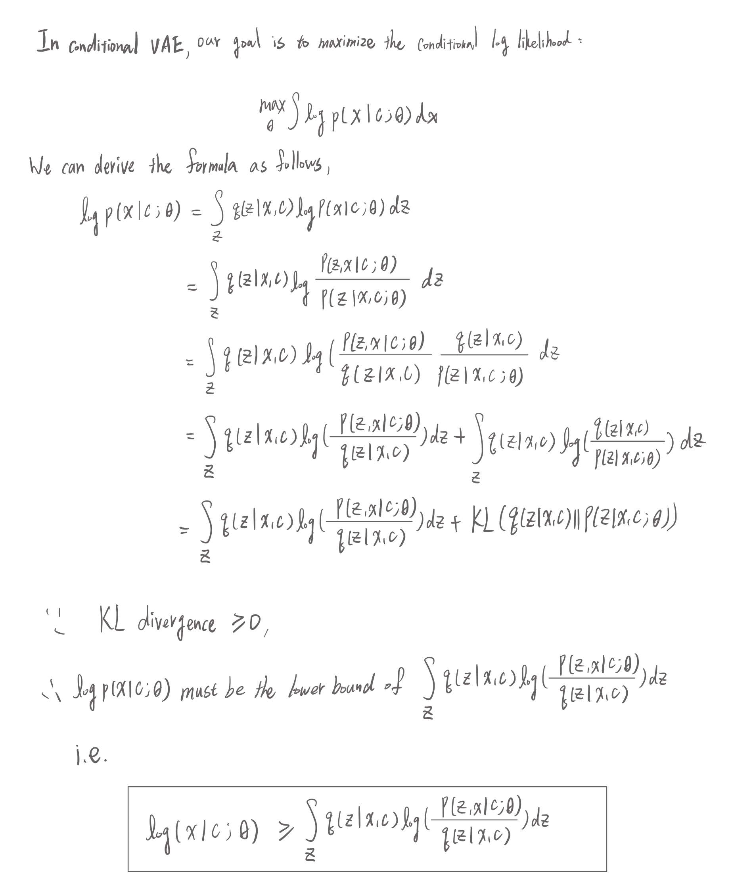
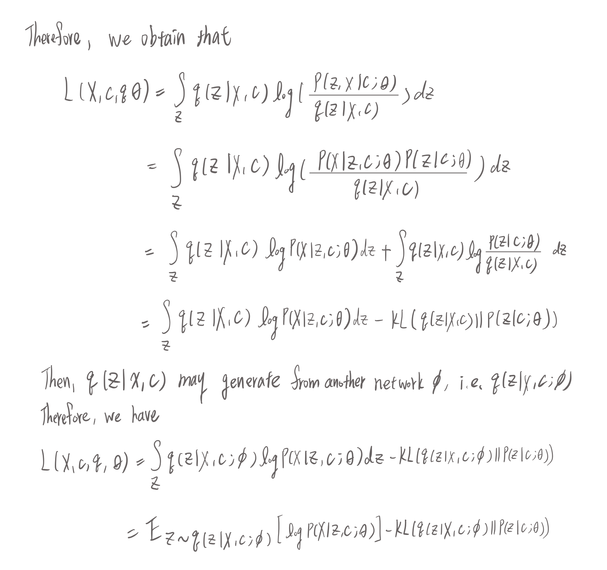

# Lab 4 - Conditional VAE for Video Prediction

> student id: 313551097<br>
> student name: 鄭淮薰

## I. Derivate conditional VAE formula




## II. Introduction
In this lab, we implemented a CVAE model for video prediction. Our goal is to generate a video sequence based on the given input frame and pose images. That is, we want to make a video that the person in the input frame is moving according to the given pose images. The model is trained with different settings, including teacher forcing ratio and KL annealing strategy. After training, we analyze the model's performance in terms of PSNR.

## III. Implementation details

### 1. How do you write your training/testing protocol

#### a. Training Protocol

In each training step, we feed a batch of images and labels into the model and one mini-batch is composed of multiple frames, whcih is the length of the video sequence. We use the first frame as the initial last frame and predict the next frame based on the last frame and the current label. The model is trained with the following steps:

1. Transform the frame and label from RGB-domain to feature-domain
2. Feed the current frame and label into the Gaussian Predictor to get the param z, mean, and logvar
3. Use the Decoder Fusion to combine the last frame, current label, and z to get the output
4. Generate the next frame by feeding the decoder output into the Generator
5. Compute the Reconstruction Loss and KL Divergence Loss
6. Repeat the above steps for all frames in the video sequence
7. After finishing all frames in the video sequence, compute the total loss of the mini-batch and backpropagate the loss

```python
    def training_one_step(self, batch_images, batch_labels, adapt_TeacherForcing):
        beta = self.kl_annealing.get_beta()
        total_loss = 0
        total_mse_loss, total_kl_loss = 0., 0.
        
        for (images, labels) in (zip(batch_images, batch_labels)):
            mse_loss, kl_loss = 0., 0.
            
            # Take the first frame as the initial last frame
            last_frame = images[0, :, :, :].unsqueeze(0)
            for i in range(1, self.train_vi_len):
                current_frame = images[i, :, :, :].unsqueeze(0)
                current_label = labels[i, :, :, :].unsqueeze(0)
                
                # Transform the image from RGB-domain to feature-domain
                last_frame_feature = self.frame_transformation(last_frame)
                current_frame_feature = self.frame_transformation(current_frame)
                current_label_feature = self.label_transformation(current_label)
                
                # Conduct Posterior prediction in Encoder
                z, mu, logvar = self.Gaussian_Predictor(
                    current_frame_feature, current_label_feature
                )

                # Decoder Fusion
                output = self.Decoder_Fusion(
                    last_frame_feature, current_label_feature, z
                )

                # Generative model
                generated_frame = self.Generator(output)

                # Compute loss
                mse_loss += self.mse_criterion(generated_frame, current_frame)
                kl_loss += kl_criterion(mu, logvar, self.batch_size)

                # Update the last frame with teacher forcing strategy
                if adapt_TeacherForcing:
                    last_frame = current_frame
                else:
                    last_frame = generated_frame

            # Compute one loss of the mini-batch
            loss = mse_loss + beta * kl_loss
            total_loss += loss
            total_mse_loss += mse_loss
            total_kl_loss += kl_loss

            # Backward
            self.optim.zero_grad()
            loss.backward()
            self.optimizer_step()

        return total_loss / len(batch_images), 
               total_mse_loss / len(batch_images), 
               total_kl_loss / len(batch_images)
```
**Loss**
There are two loss functions we used in the training process.
One is the Mean Squared Error (MSE) loss, which is used to measure the difference between the generated frame and the ground truth frame.
The other is the KL Divergence loss, which is used to measure the difference between the predicted distribution and the standard normal distribution.
And we compute the total loss by adding the MSE loss and the KL Divergence loss with the KL annealing ratio.
```python
total_loss = mse_loss + beta * kl_loss
```

#### b. Testing Protocol

### 2. How do you implement reparameterization tricks
### 3. How do you set your teacher forcing strategy
### 4. How do you set your kl annealing ratio

## IV. Analysis & Discussion

### 1. Plot Teacher forcing ratio
**a. Analysis & compare with the loss curve**

### 2. Plot the loss curve while training with different settings

#### a. With KL annealing (Monotonic)
#### b. With KL annealing (Cyclical)
#### c. Without KL annealing

### 3. Plot the PSNR-per frame diagram in validation dataset

### 4. Other training strategy analysis