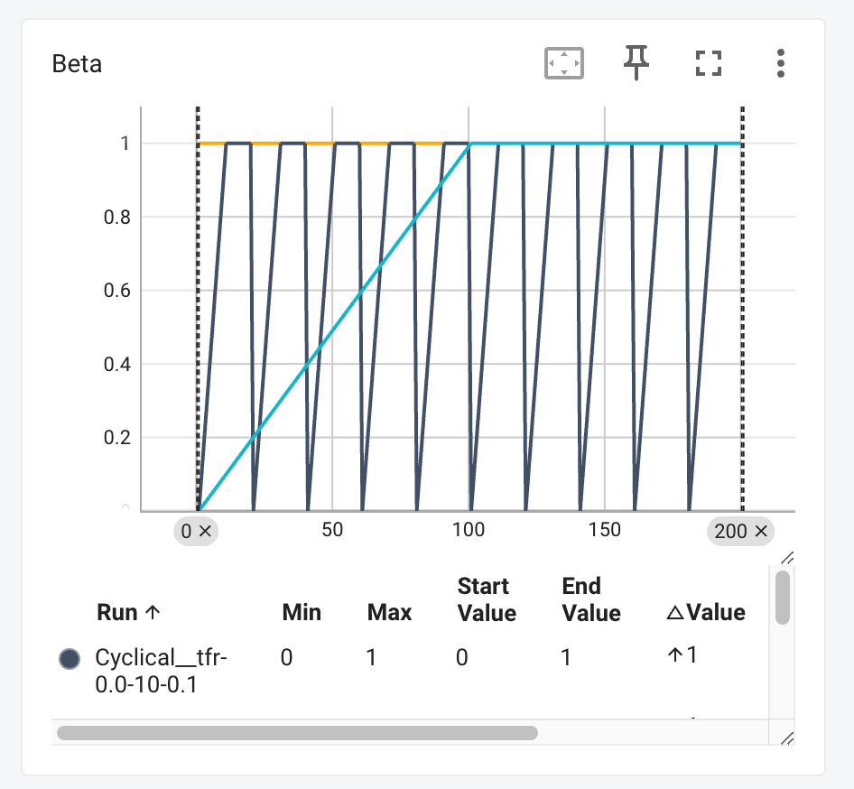
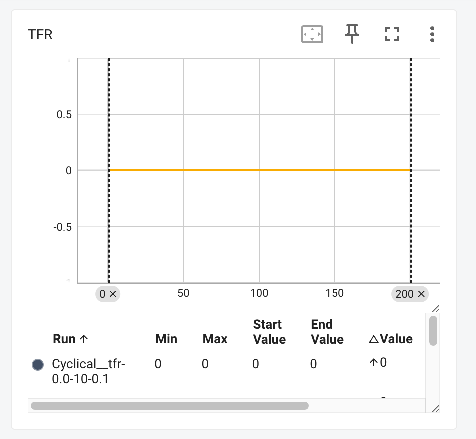

# Lab 4 - Conditional VAE for Video Prediction

> student id: 313551097<br>
> student name: 鄭淮薰

## I. Derivate conditional VAE formula


## II. Introduction

In this lab, we implemented a CVAE model for video prediction. Our goal is to generate a video sequence based on the given input frame and pose images. That is, we want to make a video that the person in the input frame is moving according to the given pose images. The model is trained with different settings, including teacher forcing ratio and KL annealing strategy. After training, we analyze the model's performance in terms of PSNR.

## III. Implementation details

### 1. How do you write your training/testing protocol

#### a. Training Protocol

In each training step, we feed a batch of images and labels into the model and one mini-batch is composed of multiple frames, whcih is the length of the video sequence. We use the first frame as the initial last frame and predict the next frame based on the last frame and the current label. The model is trained with the following steps:

1. Transform the frame and label from RGB-domain to feature-domain
2. Feed the current frame and label into the Gaussian Predictor to get the param z, mean, and logvar
3. Use the Decoder Fusion to combine the last frame, current label, and z to get the output
4. Generate the next frame by feeding the decoder output into the Generator
5. Compute the Reconstruction Loss and KL Divergence Loss
6. Repeat the above steps for all frames in the video sequence
7. After finishing all frames in the video sequence, compute the total loss of the mini-batch and backpropagate the loss

```python
    def training_one_step(self, batch_images, batch_labels, adapt_TeacherForcing):
        beta = self.kl_annealing.get_beta()
        total_loss = 0
        total_mse_loss, total_kl_loss = 0., 0.

        for (images, labels) in (zip(batch_images, batch_labels)):
            mse_loss, kl_loss = 0., 0.

            # Take the first frame as the initial last frame
            last_frame = images[0, :, :, :].unsqueeze(0)
            for i in range(1, self.train_vi_len):
                current_frame = images[i, :, :, :].unsqueeze(0)
                current_label = labels[i, :, :, :].unsqueeze(0)

                # Transform the image from RGB-domain to feature-domain
                last_frame_feature = self.frame_transformation(last_frame)
                current_frame_feature = self.frame_transformation(current_frame)
                current_label_feature = self.label_transformation(current_label)

                # Conduct Posterior prediction in Encoder
                z, mu, logvar = self.Gaussian_Predictor(
                    current_frame_feature, current_label_feature
                )

                # Decoder Fusion
                output = self.Decoder_Fusion(
                    last_frame_feature, current_label_feature, z
                )

                # Generative model
                generated_frame = self.Generator(output)

                # Compute loss
                mse_loss += self.mse_criterion(generated_frame, current_frame)
                kl_loss += kl_criterion(mu, logvar, self.batch_size)

                # Update the last frame with teacher forcing strategy
                if adapt_TeacherForcing:
                    last_frame = current_frame
                else:
                    last_frame = generated_frame

            # Compute one loss of the mini-batch
            loss = mse_loss + beta * kl_loss
            total_loss += loss
            total_mse_loss += mse_loss
            total_kl_loss += kl_loss

            # Backward
            self.optim.zero_grad()
            loss.backward()
            self.optimizer_step()

        return total_loss / len(batch_images),
               total_mse_loss / len(batch_images),
               total_kl_loss / len(batch_images)
```

**Loss**
There are two loss functions we used in the training process.
One is the Mean Squared Error (MSE) loss. We use it as the reconstruction loss to measure the difference between the generated frame and the ground truth frame.
The other is the KL Divergence loss, which is used to measure the difference between the predicted distribution and the prior distribution.
And we compute the total loss by adding the MSE loss and the KL Divergence loss with the KL annealing ratio beta. The beta is a hyperparameter that controls the trade-off between the reconstruction loss and the KL Divergence loss. We set the total loss as follows:

```python
total_loss = mse_loss + beta * kl_loss
```

#### b. Testing Protocol

The testing protocal is similar to the training protocal. We feed the last frame and the current label into the model to predict the next frame. The difference is that we randomly sample the noise z from N(0, 1) instead of getting it from the Gaussian Predictor.

```python
def val_one_step(self, img, label, idx=0):
    img = img.permute(1, 0, 2, 3, 4) # change tensor into (seq, B, C, H, W)
    label = label.permute(1, 0, 2, 3, 4) # change tensor into (seq, B, C, H, W)
    assert label.shape[0] == 630, "Testing pose seqence should be 630"
    assert img.shape[0] == 1, "Testing video seqence should be 1"

    decoded_frame_list = [img[0].cpu()]
    label_list = [label[0].cpu()]

    for i in range(1, label.shape[0]):
        current_label = label[i]
        prev_frame = decoded_frame_list[-1].to(self.args.device)

        # Transform the image from RGB-domain to feature-domain
        current_frame = self.frame_transformation(prev_frame)
        current_label = self.label_transformation(current_label)

        # Randomly sample the noise from N(0, 1) => 1, 12, 32, 64
        z_shape = (1, self.args.N_dim, self.args.frame_H, self.args.frame_W)
        z = torch.randn(z_shape).to(self.args.device)

        # Decoder the fusion feature to the output frame
        decoded_frame = self.Decoder_Fusion(current_frame, current_label, z)

        # Generate the frame from the fusion feature
        generated_frame = self.Generator(decoded_frame)

        # Append the generated frame to the decoded_frame_list
        decoded_frame_list.append(generated_frame.cpu())
        label_list.append(label[i].cpu())

        # ( ... omitted ... )
```

### 2. How do you implement reparameterization tricks

Originally, the VAE model samples the noise z from N(mu, sigma^2) directly. However, the sampling operation is not differentiable, which makes it impossible to update the gradient through backpropagation. To solve this problem, we use the reparameterization trick to sample the noise z from N(0, 1) and then transform it to N(mu, sigma^2) by a linear transformation. The reparameterization trick is implemented as follows:

```python
def reparameterize(self, mu, logvar):
    std = torch.exp(0.5 * logvar)
    eps = torch.randn_like(std)
    return mu + eps * std
```

By doing this, the only non-differentiable operation is the sampling of the noise z from N(0, 1) which is independent of the model parameters. Therefore, the gradient can be updated through backpropagation.

### 3. How do you set your teacher forcing strategy

### 4. How do you set your kl annealing ratio

## IV. Analysis & Discussion

### 1. Plot Teacher forcing ratio

#### a. Analysis & compare with the loss curve

### 2. Plot the loss curve while training with different settings

I trained the model with three different KL annealing strategies, including Monotonic, Cyclical, and Without KL annealing. The teacher forcing ratio is set to 0. The training settings are as follows:

#### a. With KL annealing (Monotonic)

- Run ID: `Monotonic__tfr-0.0-10-0.1__wandering-snowflake-7`
- kl_anneal_ratio: 0.5
- kl_anneal_cycle: 10

  **Command**

  ```bash
  python Trainer.py --DR ../dataset --save_root ../saved_models/Monotonic \
          --lr 0.0001 --num_epoch 200 --tfr 0 --kl_anneal_type Monotonic \
          --kl_anneal_ratio 0.5
  ```

#### b. With KL annealing (Cyclical)

- Run ID: `Cyclical__tfr-0.0-10-0.1`
- kl_anneal_ratio: 0.5
- kl_anneal_cycle: 10

  **Command**

  ```bash
  python Trainer.py --DR ../dataset --save_root ../saved_models/Cyclical \
          --lr 0.0001 --num_epoch 200 --tfr 0 --kl_anneal_type Cyclical \
          --kl_anneal_ratio 0.5
  ```

#### c. Without KL annealing

- Run ID: `None__tfr-0.0-10-0.1__still-night-10`

  **Command**

  ```bash
  python Trainer.py --DR ../dataset --save_root ../saved_models/Without \
          --lr 0.0001 --num_epoch 200 --tfr 0 --kl_anneal_type None \
          --kl_anneal_ratio 0.5
  ```

由下方 Loss Curve 可以看出，使用 Cyclical KL annealing 策略的模型在訓練過程中，loss 有明顯的週期震盪，而 Monotonic KL annealing 策略則是讓模型初期的 loss 顯著下降，後期趨近穩定。而沒有使用 KL annealing 策略的模型則是 loss 穩定平滑下降。整體來說，雖然三者都能讓模型有效收斂，但 Cyclical KL annealing 策略在訓練資料上的表現較沒有其他兩者佳。

|                       Loss Curve                        |
| :-----------------------------------------------------: |
|  |

|                       Beta                        |                       TFR                       |
| :-----------------------------------------------: | :---------------------------------------------: |
|  |  |

### 3. Plot the PSNR-per frame diagram in validation dataset

以下是三種不同 KL annealing 策略的模型在驗證資料集上的 PSNR-per frame 圖表。可以看到，使用 KL annealing 策略的模型在 PSNR 表現約在 25 ~ 26 之間，而沒有使用 KL annealing 策略的模型則是 PSNR 表現較佳，約在 34 左右。

|                                              Cyclical                                              |                                                                Monotonic                                                                 |                                                    Without                                                     |
| :------------------------------------------------------------------------------------------------: | :--------------------------------------------------------------------------------------------------------------------------------------: | :------------------------------------------------------------------------------------------------------------: |
|  |  |  |

|                    PSNR Comparison                    |
| :---------------------------------------------------: |
|  |

### 4. Other training strategy analysis
