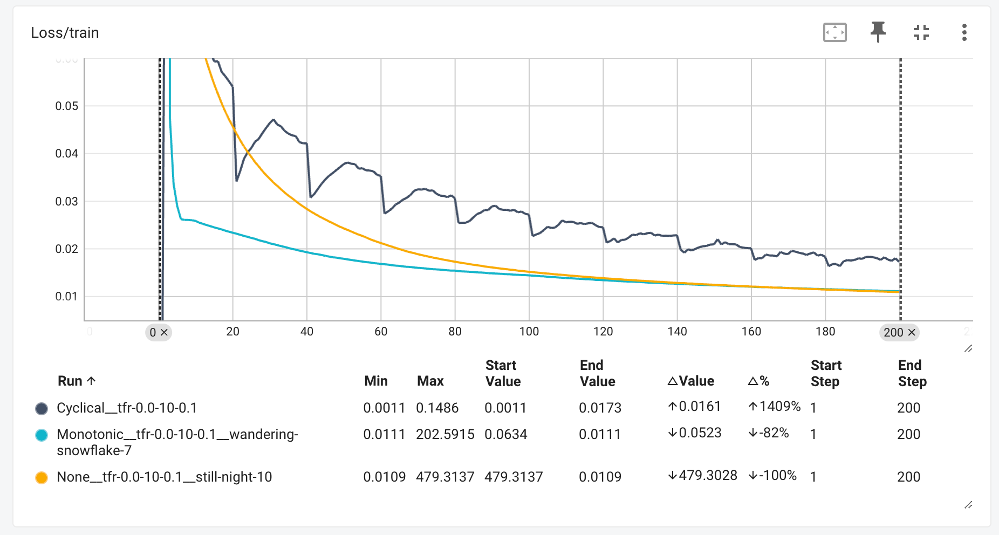
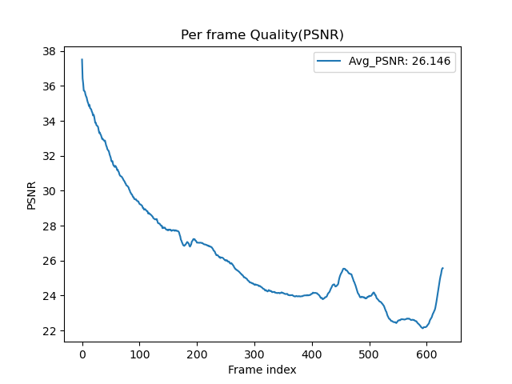
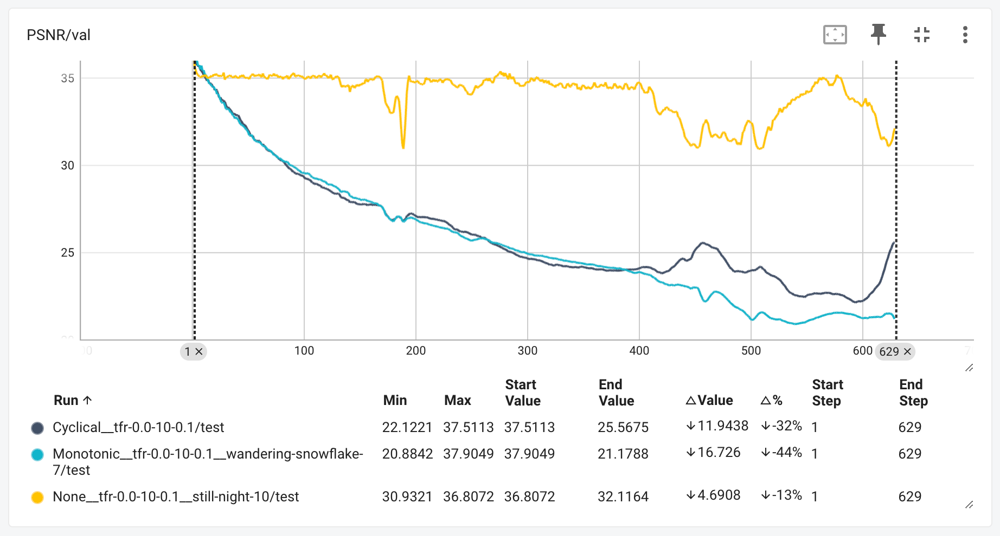

# Lab 4 - Conditional VAE for Video Prediction

> student id: 313551097<br>
> student name: 鄭淮薰

## I. Derivate conditional VAE formula


## II. Introduction

In this lab, we implemented a CVAE model for video prediction. Our goal is to generate a video sequence based on the given input frame and pose images. That is, we want to make a video that the person in the input frame is moving according to the given pose images. The model is trained with different settings, including teacher forcing ratio and KL annealing strategy. After training, we analyze the model's performance in terms of PSNR.

## III. Implementation details

### 1. How do you write your training/testing protocol

#### a. Training Protocol

In each training step, we feed a batch of images and labels into the model and one mini-batch is composed of multiple frames, whcih is the length of the video sequence. We use the first frame as the initial last frame and predict the next frame based on the last frame and the current label. The model is trained with the following steps:

1. Transform the frame and label from RGB-domain to feature-domain
2. Feed the current frame and label into the Gaussian Predictor to get the param z, mean, and logvar
3. Use the Decoder Fusion to combine the last frame, current label, and z to get the output
4. Generate the next frame by feeding the decoder output into the Generator
5. Compute the Reconstruction Loss and KL Divergence Loss
6. Repeat the above steps for all frames in the video sequence
7. After finishing all frames in the video sequence, compute the total loss of the mini-batch and backpropagate the loss

```python
    def training_one_step(self, batch_images, batch_labels, adapt_TeacherForcing):
        beta = self.kl_annealing.get_beta()
        total_loss = 0
        total_mse_loss, total_kl_loss = 0., 0.

        for (images, labels) in (zip(batch_images, batch_labels)):
            mse_loss, kl_loss = 0., 0.

            # Take the first frame as the initial last frame
            last_frame = images[0, :, :, :].unsqueeze(0)
            for i in range(1, self.train_vi_len):
                current_frame = images[i, :, :, :].unsqueeze(0)
                current_label = labels[i, :, :, :].unsqueeze(0)

                # Transform the image from RGB-domain to feature-domain
                last_frame_feature = self.frame_transformation(last_frame)
                current_frame_feature = self.frame_transformation(current_frame)
                current_label_feature = self.label_transformation(current_label)

                # Conduct Posterior prediction in Encoder
                z, mu, logvar = self.Gaussian_Predictor(
                    current_frame_feature, current_label_feature
                )

                # Decoder Fusion
                output = self.Decoder_Fusion(
                    last_frame_feature, current_label_feature, z
                )

                # Generative model
                generated_frame = self.Generator(output)

                # Compute loss
                mse_loss += self.mse_criterion(generated_frame, current_frame)
                kl_loss += kl_criterion(mu, logvar, self.batch_size)

                # Update the last frame with teacher forcing strategy
                if adapt_TeacherForcing:
                    last_frame = current_frame
                else:
                    last_frame = generated_frame

            # Compute one loss of the mini-batch
            loss = mse_loss + beta * kl_loss
            total_loss += loss
            total_mse_loss += mse_loss
            total_kl_loss += kl_loss

            # Backward
            self.optim.zero_grad()
            loss.backward()
            self.optimizer_step()

        return total_loss / len(batch_images),
               total_mse_loss / len(batch_images),
               total_kl_loss / len(batch_images)
```

**Loss**

There are two loss functions we used in the training process.
One is the Mean Squared Error (MSE) loss. We use it as the reconstruction loss to measure the difference between the generated frame and the ground truth frame.
The other is the KL Divergence loss, which is used to measure the difference between the predicted distribution and the prior distribution.
And we compute the total loss by adding the MSE loss and the KL Divergence loss with the KL annealing ratio beta. The beta is a hyperparameter that controls the trade-off between the reconstruction loss and the KL Divergence loss. We set the total loss as follows:

```python
total_loss = mse_loss + beta * kl_loss
```

#### b. Testing Protocol

The testing protocal is similar to the training protocal. We feed the last frame and the current label into the model to predict the next frame. The difference is that we randomly sample the noise z from N(0, 1) instead of getting it from the Gaussian Predictor.

```python
def val_one_step(self, img, label, idx=0):
    img = img.permute(1, 0, 2, 3, 4) # change tensor into (seq, B, C, H, W)
    label = label.permute(1, 0, 2, 3, 4) # change tensor into (seq, B, C, H, W)
    assert label.shape[0] == 630, "Testing pose seqence should be 630"
    assert img.shape[0] == 1, "Testing video seqence should be 1"

    decoded_frame_list = [img[0].cpu()]
    label_list = [label[0].cpu()]

    for i in range(1, label.shape[0]):
        current_label = label[i]
        prev_frame = decoded_frame_list[-1].to(self.args.device)

        # Transform the image from RGB-domain to feature-domain
        current_frame = self.frame_transformation(prev_frame)
        current_label = self.label_transformation(current_label)

        # Randomly sample the noise from N(0, 1) => 1, 12, 32, 64
        z_shape = (1, self.args.N_dim, self.args.frame_H, self.args.frame_W)
        z = torch.randn(z_shape).to(self.args.device)

        # Decoder the fusion feature to the output frame
        decoded_frame = self.Decoder_Fusion(current_frame, current_label, z)

        # Generate the frame from the fusion feature
        generated_frame = self.Generator(decoded_frame)

        # Append the generated frame to the decoded_frame_list
        decoded_frame_list.append(generated_frame.cpu())
        label_list.append(label[i].cpu())

        # ( ... omitted ... )
```

### 2. How do you implement reparameterization tricks

Originally, the VAE model samples the noise z from N(mu, sigma^2) directly. However, the sampling operation is not differentiable, which makes it impossible to update the gradient through backpropagation. To solve this problem, we use the reparameterization trick to sample the noise z from N(0, 1) and then transform it to N(mu, sigma^2) by a linear transformation. The reparameterization trick is implemented as follows:

```python
def reparameterize(self, mu, logvar):
    std = torch.exp(0.5 * logvar)
    eps = torch.randn_like(std)
    return mu + eps * std
```

By doing this, the only non-differentiable operation is the sampling of the noise z from N(0, 1) which is independent of the model parameters. Therefore, the gradient can be updated through backpropagation.

### 3. How do you set your teacher forcing strategy

We use the teacher forcing strategy to decide how much to use the real frame or the generated frame for the next input. As the training goes on, we slowly change the teacher forcing ratio over the epochs. Starting from a certain point, we update it at the beginning of each epoch based on a set step size. The implementation is as follows:

```python
def teacher_forcing_ratio_update(self):
    if self.current_epoch >= self.tfr_sde:
        self.tfr = max(0, self.tfr - self.tfr_d_step)
```

### 4. How do you set your kl annealing ratio

I tried out two different KL annealing strategies based on a paper: Monotonic and Cyclical. Then, I compared how these strategies performed during training against a model that didn’t use any KL annealing.

For the Cyclical strategy, the length of each cycle is set based on the total number of training epochs and the number of cycles. At the start of each cycle, the beta value gradually increases from 0 to 1. Once it hits a certain point in the cycle, beta stays at 1 until the cycle ends.

With the Monotonic strategy, beta gradually increases from 0 to 1 throughout the entire training process and then stays at 1 until training is done.

For the model without KL annealing, I just kept beta at 1 the whole time.

```python
class kl_annealing():
    def __init__(self, args, current_epoch=0):
        self.iter = current_epoch - 1
        self.n_iter = args.num_epoch
        self.beta = 1 if args.kl_anneal_type == 'None' else 0
        self.beta_start = 0.
        self.beta_end = 1.
        self.kl_anneal_type = args.kl_anneal_type
        self.kl_anneal_cycle = args.kl_anneal_cycle
        self.kl_anneal_ratio = args.kl_anneal_ratio
        
        self.update()
        
    def update(self):
        self.iter += 1
        if self.kl_anneal_type == 'Cyclical':
            self.beta = self.frange_cycle_linear(
                self.iter, self.n_iter, start=self.beta_start, stop=self.beta_end, 
                n_cycle=self.kl_anneal_cycle, ratio=self.kl_anneal_ratio
            )
        elif self.kl_anneal_type == 'Monotonic':
            self.beta = self.frange_cycle_linear(
                self.iter, self.n_iter, start=self.beta_start, stop=self.beta_end, 
                n_cycle=1, ratio=self.kl_anneal_ratio
            )
        else:
            self.beta = 1
        
    
    def get_beta(self):
        return self.beta

    def frange_cycle_linear(self, iter, n_iter, start=0.0, 
                            stop=1.0,  n_cycle=1, ratio=1.):
        cycle_length = n_iter // n_cycle
        step_in_cycle = iter % cycle_length

        if step_in_cycle < cycle_length * ratio:
            return max(
                1e-6, 
                start + (stop - start) * step_in_cycle / (cycle_length * ratio)
            )
        else:
            return stop
```

## IV. Analysis & Discussion

### 1. Plot Teacher forcing ratio

#### a. Analysis & compare with the loss curve

I experimented with three different Teacher Forcing ratios: 1, 0.5, and 0, and set the ratio to decrease to 0 after the 20th epoch. The table below shows how the Teacher Forcing ratio changed during training without using the KL annealing strategy. As the TFR decreased, there was a noticeable fluctuation in the loss. Upon further examination of the Train MSE Loss and Train KL Loss, it became clear that the fluctuation in loss was primarily due to significant changes in the Train MSE Loss.

The table shows that using Teacher Forcing helps the model get a much lower training loss, but when it comes to validation, the PSNR performance isn't as good as the model that didn’t use Teacher Forcing. This suggests that while Teacher Forcing makes the model learn faster, it might hurt its ability to generalize, leading to weaker performance in real-world scenarios.

|                    Without KL annealing                    |
|:----------------------------------------------------------:|
|                    |
|  |

**Teacher Forcing Ratio = 1(Blue line)**

Command
```bash
python Trainer.py --DR ../dataset --save_root ../saved_models/Without/tfr1 --lr 0.0001 --num_epoch 100 --tfr 1 --kl_anneal_type None --kl_anneal_ratio 0.5
```

**Teacher Forcing Ratio = 0.5(Orange line)**

Command
```bash
python Trainer.py --DR ../dataset --save_root ../saved_models/Without/tfr05 --lr 0.0001 --num_epoch 100 --tfr 0.5 --tfr_d_step 0.05 --kl_anneal_type None --kl_anneal_ratio 0.5
```

**Teacher Forcing Ratio = 0(Green line)**

Command

```bash
python Trainer.py --DR ../dataset --save_root ../saved_models/Without/tfr0 --lr 0.0001 --num_epoch 100 --tfr 0 --kl_anneal_type None --kl_anneal_ratio 0.5
```

---

In contrast, the model using the KL annealing strategy and adding teacher forcing performs better than the model without teacher forcing. I think this is because the KL annealing strategy will make the model focus more on reconstruction loss rather than KL divergence loss during early training. Therefore, using teacher forcing at this stage can allow the model to learn the reconstructed features faster and reduce error transmission. . In later training, the KL annealing strategy will gradually increase the beta value, allowing the model to focus more on KL divergence loss. At this time, the teacher forcing ratio will be gradually reduced to make the model refer more to the frame generated by itself, thereby improving the generalization ability of the model.

|                       Cyclical KL annealing                        |
|:------------------------------------------------------------------:|
|                    |
|  |

**Teacher Forcing Ratio = 1(Yellow line)**
```bash
python Trainer.py --DR ../dataset --save_root ../saved_models/Cyclical/tfr1 --lr 0.0001 --num_epoch 100 --tfr 1 --kl_anneal_type Cyclical --kl_anneal_ratio 0.5
```

**Teacher Forcing Ratio = 0.5(Green line)**
```bash
python Trainer.py --DR ../dataset --save_root ../saved_models/Cyclical/tfr05 --lr 0.0001 --num_epoch 100 --tfr 0.5 --tfr_d_step 0.05 --kl_anneal_type Cyclical --kl_anneal_ratio 0.5 
```

**Teacher Forcing Ratio = 0(Red line)**
```bash
python Trainer.py --DR ../dataset --save_root ../saved_models/Cyclical/tfr0 --lr 0.0001 --num_epoch 100 --tfr 0 --kl_anneal_type Cyclical --kl_anneal_ratio 0.5
```

---

|                     Monotonic KL annealing                      |
|:---------------------------------------------------------------:|
|                    |
|  |

**Teacher Forcing Ratio = 1(Blue line)**
```bash
python Trainer.py --DR ../dataset --save_root ../saved_models/Monotonic/tfr1 --lr 0.0001 --num_epoch 100 --tfr 1 --kl_anneal_type Monotonic --kl_anneal_ratio 0.5
```

**Teacher Forcing Ratio = 0.5(Orange line)**
```bash
python Trainer.py --DR ../dataset --save_root ../saved_models/Monotonic/tfr05 --lr 0.0001 --num_epoch 100 --tfr 0.5 --tfr_d_step 0.05 --kl_anneal_type Monotonic --kl_anneal_ratio 0.5
```

**Teacher Forcing Ratio = 0(Green line)**
```bash
python Trainer.py --DR ../dataset --save_root ../saved_models/Monotonic/tfr0 --lr 0.0001 --num_epoch 100 --tfr 0 --kl_anneal_type Monotonic --kl_anneal_ratio 0.5
```


### 2. Plot the loss curve while training with different settings

I trained the model with three different KL annealing strategies, including Monotonic, Cyclical, and Without KL annealing. The teacher forcing ratio is set to 0. The training settings are as follows:

#### a. With KL annealing (Monotonic)

- Run ID: `Monotonic__tfr-0.0-10-0.1__wandering-snowflake-7`
- kl_anneal_ratio: 0.5
- kl_anneal_cycle: 10

  **Command**

  ```bash
  python Trainer.py --DR ../dataset --save_root ../saved_models/Monotonic \
          --lr 0.0001 --num_epoch 200 --tfr 0 --kl_anneal_type Monotonic \
          --kl_anneal_ratio 0.5
  ```

#### b. With KL annealing (Cyclical)

- Run ID: `Cyclical__tfr-0.0-10-0.1`
- kl_anneal_ratio: 0.5
- kl_anneal_cycle: 10

  **Command**

  ```bash
  python Trainer.py --DR ../dataset --save_root ../saved_models/Cyclical \
          --lr 0.0001 --num_epoch 200 --tfr 0 --kl_anneal_type Cyclical \
          --kl_anneal_ratio 0.5
  ```

#### c. Without KL annealing

- Run ID: `None__tfr-0.0-10-0.1__still-night-10`

  **Command**

  ```bash
  python Trainer.py --DR ../dataset --save_root ../saved_models/Without \
          --lr 0.0001 --num_epoch 200 --tfr 0 --kl_anneal_type None \
          --kl_anneal_ratio 0.5
  ```

From the Loss Curve below, it can be observed that the model using the Cyclical KL annealing strategy exhibits noticeable periodic oscillations in loss during training. In contrast, the Monotonic KL annealing strategy causes the model's loss to decrease significantly in the early stages and stabilize later on. The model without the KL annealing strategy shows a smooth and steady decrease in loss. Overall, while all three approaches lead to effective model convergence, the Cyclical KL annealing strategy performs less favorably on the training data compared to the other two.

|                       Loss Curve                        |
|:-------------------------------------------------------:|
|  |

|                       Beta                        |                       TFR                       |
|:-------------------------------------------------:|:-----------------------------------------------:|
|  |  |

### 3. Plot the PSNR-per frame diagram in validation dataset

Here is a PSNR-per-frame chart of models on the validation dataset using three different KL annealing strategies. As observed, models utilizing the KL annealing strategy have a PSNR performance ranging between 25 and 26, while models without the KL annealing strategy exhibit better PSNR performance, approximately around 34.

|                                              Cyclical                                              |                                                                Monotonic                                                                 |                                                    Without                                                     |
|:--------------------------------------------------------------------------------------------------:|:----------------------------------------------------------------------------------------------------------------------------------------:|:--------------------------------------------------------------------------------------------------------------:|
|  |  |  |

|                    PSNR Comparison                    |
|:-----------------------------------------------------:|
|  |

### 4. Other training strategy analysis

To prevent the occurrence of NaN in the loss during training, I adjusted the beta value to 1e6 when applying KL annealing. The reason for this is that beta controls the weight of the KL divergence in the total loss. If the beta value is too small, it may result in the gradient of the KL divergence being too small or numerically unstable, leading to NaN issues.

```python
if step_in_cycle < cycle_length * ratio:
    return max(1e-6, start + (stop - start) * step_in_cycle / (cycle_length * ratio))
```