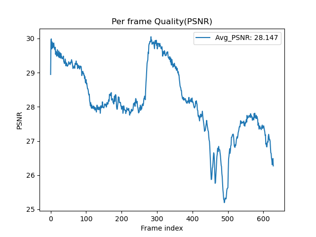

# Results

## Test for different KL annealing strategy

### Cyclical 
(gpu7-tmux0) tensorboard: Cyclical-tfr_0.0_10_0.1
```bash
python Trainer.py --DR ../dataset --save_root ../saved_models/Cyclical --lr 0.0001 --num_epoch 200 --tfr 0 --kl_anneal_type Cyclical --kl_anneal_ratio 0.5 --wandb --device cuda:3
```

### Monotonic
(gpu7-tmux1) wandb: Syncing run wandering-snowflake-7
(gpu4) Monotonic_0.5-tfr_0.0_10_0.1-20240806-181938
```bash
python Trainer.py --DR ../dataset --save_root ../saved_models/Monotonic --lr 0.0001 --num_epoch 200 --tfr 0 --kl_anneal_type Monotonic --kl_anneal_ratio 0.5 --wandb --device cuda:3
```

### None
(gpu4) wandb: Syncing run still-night-10
```bash
python Trainer.py --DR ../dataset --save_root ../saved_models/Without --lr 0.0001 --num_epoch 200 --tfr 0 --kl_anneal_type None --kl_anneal_ratio 0.5 --wandb --device cuda:1
```

## Test for different teacher forcing ratio

### tfr = 1, sde = 10, step = 0.1

**Cyclical KL Annealing**
(gpu7-tmux2) wandb: Syncing run eager-sound-11 ( Cyclical_0.5-tfr_1.0_10_0.1-20240807-033052 )
Val PSNR: 22.84535026550293


```bash
python Trainer.py --DR ../dataset --save_root ../saved_models/Cyclical/tfr1 --lr 0.0001 --num_epoch 100 --tfr 1 --kl_anneal_type Cyclical --kl_anneal_ratio 0.5 --wandb --device cuda:7
```

**Monotonic KL Annealing**

```bash
python Trainer.py --DR ../dataset --save_root ../saved_models/Monotonic/tfr1 --lr 0.0001 --num_epoch 100 --tfr 1 --kl_anneal_type Monotonic --kl_anneal_ratio 0.5 --wandb --device cuda:3
```

**Without KL Annealing**

```bash
python Trainer.py --DR ../dataset --save_root ../saved_models/Without/tfr1 --lr 0.0001 --num_epoch 100 --tfr 1 --kl_anneal_type None --kl_anneal_ratio 0.5 --wandb --device cuda:7
```

---

### tfr = 0.5, sde = 10, step = 0.05

**Cyclical KL Annealing**

(vonernue) wandb: Syncing run decent-wind-9
Val PSNR: 28.146825790405273
Test PSNR: 26.75431


```bash
python Trainer.py --DR ../dataset --save_root ../saved_models/Cyclical/tfr05 --lr 0.0001 --num_epoch 100 --tfr 0.5 --tfr_d_step 0.05 --kl_anneal_type Cyclical --kl_anneal_ratio 0.5 --wandb --device cuda:3
```

**Monotonic KL Annealing**

```bash
python Trainer.py --DR ../dataset --save_root ../saved_models/Monotonic/tfr05 --lr 0.0001 --num_epoch 100 --tfr 0.5 --tfr_d_step 0.05 --kl_anneal_type Monotonic --kl_anneal_ratio 0.5 --wandb --device cuda:3
```

**Without KL Annealing**
(gpu7-tmux2) wandb: Syncing run earnest-shape-19
```bash
python Trainer.py --DR ../dataset --save_root ../saved_models/Without/tfr05 --lr 0.0001 --num_epoch 100 --tfr 0.5 --tfr_d_step 0.05 --kl_anneal_type None --kl_anneal_ratio 0.5 --wandb --device cuda:7
```

---

### tfr = 0
**Cyclical KL Annealing**
(dlp) wandb: Syncing run glorious-sun-6
```bash
python Trainer.py --DR ../dataset --save_root ../saved_models/Cyclical/tfr0 --lr 0.0001 --num_epoch 100 --tfr 0 --kl_anneal_type Cyclical --kl_anneal_ratio 0.5 --wandb --device cuda:3
```

**Monotonic KL Annealing**

```bash
python Trainer.py --DR ../dataset --save_root ../saved_models/Monotonic/tfr0 --lr 0.0001 --num_epoch 100 --tfr 0 --kl_anneal_type Monotonic --kl_anneal_ratio 0.5 --wandb --device cuda:3
```

**Without KL Annealing**

```bash
python Trainer.py --DR ../dataset --save_root ../saved_models/Without/tfr0 --lr 0.0001 --num_epoch 100 --tfr 0 --kl_anneal_type None --kl_anneal_ratio 0.5 --wandb --device cuda:3
```

