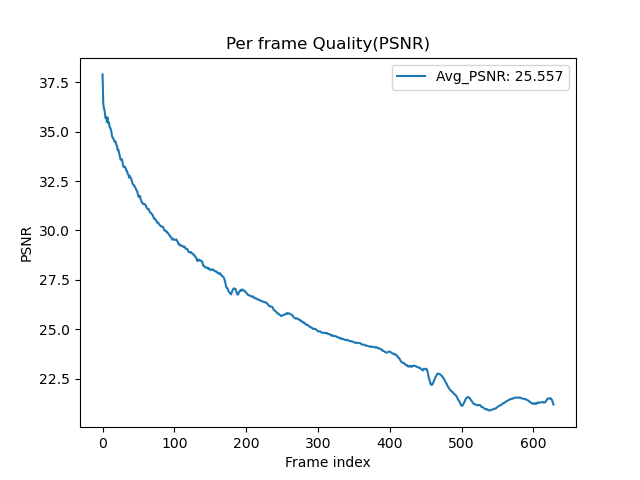
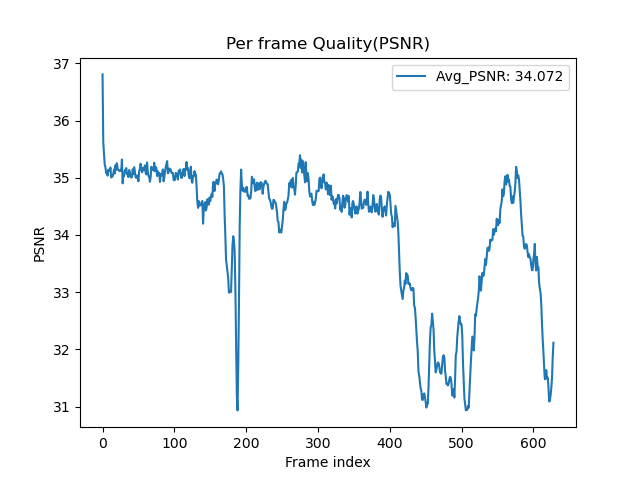

# Results

## Test for different KL annealing strategy

|                         PSNR                          |
| :---------------------------------------------------: |
|  |

|                          Loss                           |
| :-----------------------------------------------------: |
|  |

|                       Beta                        |                       TFR                       |
| :-----------------------------------------------: | :---------------------------------------------: |
|  |  |

### Cyclical

(gpu7-tmux0) tensorboard: Cyclical-tfr_0.0_10_0.1
Val PSNR: 26.14582061767578
Test Score: 23.83427

> Note: `w/o wandb` `old version`


```bash
python Trainer.py --DR ../dataset --save_root ../saved_models/Cyclical --lr 0.0001 --num_epoch 200 --tfr 0 --kl_anneal_type Cyclical --kl_anneal_ratio 0.5 --wandb --device cuda:3
```

### Monotonic

(gpu7-tmux1) wandb: Syncing run wandering-snowflake-7

> Note: `old version`

Val PSNR: 25.5565128326416
Test Score: 23.37815



```bash
python Trainer.py --DR ../dataset --save_root ../saved_models/Monotonic --lr 0.0001 --num_epoch 200 --tfr 0 --kl_anneal_type Monotonic --kl_anneal_ratio 0.5 --wandb --device cuda:3
```

### None

(gpu4) wandb: Syncing run still-night-10

> Note: `old version`

Val PSNR: 34.07182693481445
Test Score: 31.61894



```bash
python Trainer.py --DR ../dataset --save_root ../saved_models/Without --lr 0.0001 --num_epoch 200 --tfr 0 --kl_anneal_type None --kl_anneal_ratio 0.5 --wandb --device cuda:1
```

(gpu4-tmux0) wandb: Syncing run wild-river-27

```bash
python Trainer.py --DR ../dataset --save_root ../saved_models/Without/tfr0 --lr 0.0001 --num_epoch 400 --tfr 0 --kl_anneal_type None --kl_anneal_ratio 0.5 --wandb --device cuda:1
```

## Test for different teacher forcing ratio

|                       Cyclical Train Loss                        |
| :--------------------------------------------------------------: |
|  |

|                        Cyclical PSNR                         |
| :----------------------------------------------------------: |
|  |

|                    Cyclical Beta                     |                    Cyclical TFR                    |
| :--------------------------------------------------: | :------------------------------------------------: |
|  |  |

---

### tfr = 1, sde = 10, step = 0.1

**Cyclical KL Annealing**
(gpu7-tmux2) wandb: Syncing run eager-sound-11 ( Cyclical_0.5-tfr_1.0_10_0.1-20240807-033052 )
Val PSNR: 22.758983612060547

> Note: `old version`


<!-- TODO -->

(gpu7-tmux3) wandb: Syncing run hopeful-thunder-32

> Note: `latest version`

```bash
python Trainer.py --DR ../dataset --save_root ../saved_models/Cyclical/tfr1 --lr 0.0001 --num_epoch 100 --tfr 1 --kl_anneal_type Cyclical --kl_anneal_ratio 0.5 --wandb --device cuda:7
```

**Monotonic KL Annealing**
(gpu7-tmux0) wandb: Syncing run hearty-armadillo-24

> Note: `latest version`

Val PSNR: 26.06894874572754


```bash
python Trainer.py --DR ../dataset --save_root ../saved_models/Monotonic/tfr1 --lr 0.0001 --num_epoch 100 --tfr 1 --kl_anneal_type Monotonic --kl_anneal_ratio 0.5 --wandb --device cuda:3
```

**Without KL Annealing**
(gpu4-tumx1) wandb: Syncing run peach-cosmos-23

> Note: `latest version`

Val PSNR: 20.617340087890625


```bash
python Trainer.py --DR ../dataset --save_root ../saved_models/Without/tfr1 --lr 0.0001 --num_epoch 100 --tfr 1 --kl_anneal_type None --kl_anneal_ratio 0.5 --wandb --device cuda:7
```

---

### tfr = 0.5, sde = 10, step = 0.05

**Cyclical KL Annealing**

(vonernue) wandb: Syncing run decent-wind-9
Val PSNR: 28.181432723999023
Test PSNR: 26.75431

> Note: `old version` `resume`


<!-- TODO -->

(gpu7-tmux2) wandb: Syncing run soft-voice-30

> Note: `latest version`

```bash
python Trainer.py --DR ../dataset --save_root ../saved_models/Cyclical/tfr05 --lr 0.0001 --num_epoch 100 --tfr 0.5 --tfr_d_step 0.05 --kl_anneal_type Cyclical --kl_anneal_ratio 0.5 --wandb --device cuda:3
```

**Monotonic KL Annealing**
(gpu7-tmux3) wandb: Syncing run fearless-monkey-21

> Note: `latest version`

Val PSNR: 25.91168785095215


```bash
python Trainer.py --DR ../dataset --save_root ../saved_models/Monotonic/tfr05 --lr 0.0001 --num_epoch 100 --tfr 0.5 --tfr_d_step 0.05 --kl_anneal_type Monotonic --kl_anneal_ratio 0.5 --wandb --device cuda:4
```

**Without KL Annealing**
(gpu7-tmux2) wandb: Syncing run ancient-voice-22

> Note: `latest version`

Val PSNR: 20.92759132385254


```bash
python Trainer.py --DR ../dataset --save_root ../saved_models/Without/tfr05 --lr 0.0001 --num_epoch 100 --tfr 0.5 --tfr_d_step 0.05 --kl_anneal_type None --kl_anneal_ratio 0.5 --wandb --device cuda:7
```

---

### tfr = 0

**Cyclical KL Annealing**
(dlp) wandb: Syncing run glorious-sun-6

> Note: `old version`

Val PSNR: 22.769935607910156


<!-- TODO -->

(gpu4-tmux1) wandb: Syncing run still-armadillo-31

> Note: `latest version`

```bash
python Trainer.py --DR ../dataset --save_root ../saved_models/Cyclical/tfr0 --lr 0.0001 --num_epoch 100 --tfr 0 --kl_anneal_type Cyclical --kl_anneal_ratio 0.5 --wandb --device cuda:3
```

**Monotonic KL Annealing**

<!-- TODO -->

(gpu7-tmux0) wandb: Syncing run sunny-snow-28

> Note: `latest version`

```bash
python Trainer.py --DR ../dataset --save_root ../saved_models/Monotonic/tfr0 --lr 0.0001 --num_epoch 100 --tfr 0 --kl_anneal_type Monotonic --kl_anneal_ratio 0.5 --wandb --device cuda:3
```

**Without KL Annealing**

<!-- TODO -->

(gpu4-tmux1) wandb: Syncing run dainty-bee-29

> Note: `latest version`

```bash
python Trainer.py --DR ../dataset --save_root ../saved_models/Without/tfr0 --lr 0.0001 --num_epoch 100 --tfr 0 --kl_anneal_type None --kl_anneal_ratio 0.5 --wandb --device cuda:4
```
