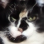
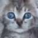
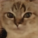
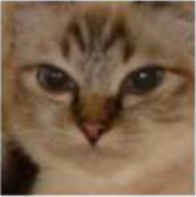

# Lab5 MaskGIT for Image Inpainting Experiment Score

> student id: 313551097  
> student name: 鄭淮薰

## Part1: Prove your code implementation is correct

### Show iterative decoding

- cosine
- linear
- square

#### (a) Mask in latent domain

From the following images, we can observe that the cosine and square methods fill less mask in the early stage, and gradually increase the amount of filling in the later stage, while the linear method maintains a certain amount of filling.

| cosine     |         |
|------------|-------------------------------------------------|
| **linear** |  |
| **square** |  |

#### (b) Predicted image

| cosine     |  |
|------------|--------------------------------------------|
| **linear** |  |
| **square** |  |

## Part2: The Best FID Score

### Screenshot

### Masked Images v.s MaskGIT Inpainting Results v.s Ground Truth

| Masked Images                  |  |  |  |  |  |  |
|--------------------------------|------------------------------------------|------------------------------------------|------------------------------------------|------------------------------------------|------------------------------------------|------------------------------------------|
| **MaskGIT Inpainting Results** |          |          |          |          |          |          |
| **Ground Truth**               |                  |                  |                  |                  |                  |                |

### The setting about training strategy, mask scheduling parameters, and so on

- learning rate: 1e-4
- batch size: 10
- epochs: 300
- optimizer: Adam
- sweet spot: 8
- total iteration: 8
- mask function: cosine