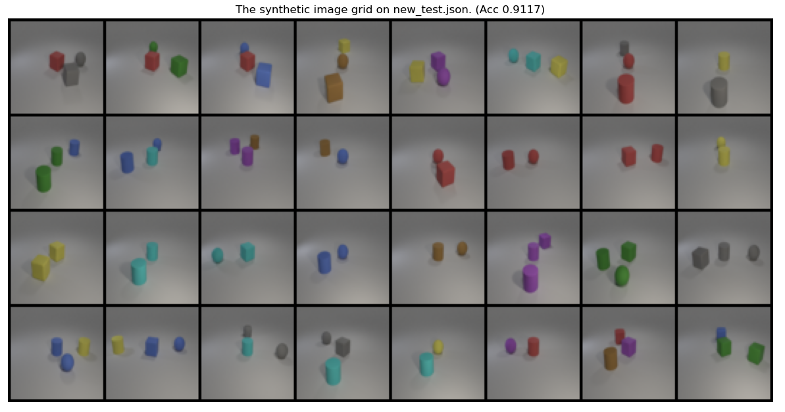
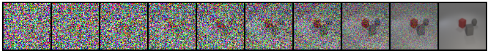

# Lab6 - Generative Models

> student id: 313551097  
> student name: 鄭淮薰

# Report

## I. Introduction

In this lab, we implement a generative model called Diffusion Probabilistic Models (DDPM) to generate synthetic images based on given multi-labels. We use the existing `diffusers` library to build and train the DDPM model with the provided training data. After training, we evaluate the model using `test.json` and `new_test.json` by generating synthetic images and measuring the accuracy with a pretrained evaluator. The results show that the accuracy of the generated images on both datasets is above 90%

## II. Implementation details

### A. Model
> Reference 1: https://github.com/huggingface/diffusion-models-class
> Reference 2: https://huggingface.co/docs/diffusers/tutorials/basic_training

I used the `UNet2DModel` from the `diffusers` library to build a ConditionalDDPM model and designed the architecture based on a Hugging Face example. The model outputs 64x64 images with 3 channels. The architecture follows the example closely, with six levels and added attention blocks to better capture relationships between different locations in the image, which results in more consistent details. To enable conditional image generation, the one-hot encoded labels are first passed through a `linear layer` to transform them into vectors with the specified dimensions, which are then used as class embeddings in the model.

```python
class ConditionalDDPM(nn.Module):
    def __init__(self, num_labels=24, dim=512):
        super().__init__()
        self.label_embedding = nn.Linear(num_labels, dim)
        self.diffusion = UNet2DModel(
            sample_size=64,
            in_channels=3,
            out_channels=3,
            layers_per_block=2,
            block_out_channels=(dim//4, dim//4, dim//2, dim//2, dim, dim),
            down_block_types=[
                "DownBlock2D",
                "DownBlock2D",
                "DownBlock2D",
                "DownBlock2D",
                "AttnDownBlock2D",
                "DownBlock2D",
            ],
            up_block_types=[
                "UpBlock2D",
                "AttnUpBlock2D",
                "UpBlock2D",
                "UpBlock2D",
                "UpBlock2D",
                "UpBlock2D",
            ],
            class_embed_type="identity",
            num_class_embeds=dim
        )
        
        
    def forward(self, x, timesteps, label):
        label = self.label_embedding(label)
        return self.diffusion(x, timesteps, label).sample
```

### B. Noise schedule

For the noise schedule setup, I used the `DDPMScheduler` from the `diffusers` library and configured it with 1,000 timesteps to simulate the image generation process. This noise schedule is based on the `squaredcos_cap_v2` design, which allows noise to be gradually increased during training. It introduces noise more smoothly in the early and late stages, avoiding excessive noise being added too early or too late. 

In the diagram below, the blue line represents $\sqrt{\bar{\alpha}_t}$, which shows the trend of the signal as timesteps progress, while the orange line represents $\sqrt{1 - \bar{\alpha}_t}$, indicating how the noise level gradually increases as the timesteps advance.

```python
noise_schedule = DDPMScheduler(
    num_train_timesteps=1000, 
    beta_schedule="squaredcos_cap_v2"
)
```


### C. Dataloader

Dataloader 的部分我設計了兩個類別，分別是 `LoadTrainData` 和 `LoadTestData`。`LoadTrainData` 用來載入訓練資料，並將影像轉換成模型所需的格式，同時將 label 轉換成 one-hot encoded tensor。`LoadTestData` 則是用來載入測試資料，並將 label 轉換成 one-hot encoded tensor。

```python
class LoadTrainData(torchData):
    def __init__(self, root, train_json, object_json):
        super().__init__()
        self.root = root
        self.transform = transforms.Compose([
            transforms.Resize((64, 64)),
            transforms.ToTensor(),
            transforms.Normalize(mean=[0.5, 0.5, 0.5], std=[0.5, 0.5, 0.5])
        ])
        
        with open(train_json, 'r') as f:
            data = json.load(f)
            self.image_path, self.labels = zip(*data.items())
            
        with open(object_json, 'r') as f:
            self.label_map = json.load(f)
            
    def __len__(self):
        return len(self.labels)
    
    @property
    def info(self):
        return f"\nNumber of Training Data: {len(self.labels)}"
    
    def __getitem__(self, index):
        # Load and transform image
        img_path = os.path.join(self.root, self.image_path[index])
        img = self.transform(imgloader(img_path))
            
        # Convert labels to a multi-hot tensor
        label_tensor = torch.zeros(len(self.label_map))
        for label in self.labels[index]:
            label_tensor[self.label_map[label]] = 1
            
        return img, label_tensor
```
```python
class LoadTestData(torchData):
    def __init__(self, root, test_json, object_json):
        super().__init__()
        self.root = root
        self.transform = transforms.Compose([
            transforms.Resize((64, 64)),
            transforms.ToTensor(),
            transforms.Normalize(mean=[0.5, 0.5, 0.5], std=[0.5, 0.5, 0.5])
        ])
        
        with open(test_json, 'r') as f:
            self.labels = json.load(f)
        
        with open(object_json, 'r') as f:
            self.label_map = json.load(f)
            
    def __len__(self):
        return len(self.labels)
    
    @property
    def info(self):
        return f"\nNumber of Test Data: {len(self.labels)}"
    
    def __getitem__(self, index):
        # Convert labels to a multi-hot tensor
        label_tensor = torch.zeros(len(self.label_map))
        for label in self.labels[index]:
            label_tensor[self.label_map[label]] = 1
            
        return label_tensor
```
### D. Training

In the training phase, I designed a `TrainDDPM` class for training the DDPM model. During training, random noise is added to clean images, and the model predicts the noise. The Mean Squared Error (MSE) Loss between the predicted noise and the true noise is then calculated. At the end of each epoch, I save the model checkpoint and log the training loss. The main training process in each epoch includes the following steps:

1. Randomly generate noise from a standard normal distribution.
2. Randomly select timesteps from the noise schedule to determine the level of noise to be added.
3. Add noise to the images using the noise schedule to generate noisy images.
4. Predict the noise using the model.
5. Calculate the MSE Loss between the predicted noise and the true noise.
6. Perform backpropagation to update model parameters.
7. Every `accum_grad` steps, update the model parameters using the Adam optimizer.

```python
class TrainDDPM:
    def __init__(self, args, DDPM_CONFIGS):
        args.run_id = torch.randint(0, 100000, (1,)).item()
        args.run_name = "DDPM-no-log"
        self.args = args
        self.model = ConditionalDDPM(**DDPM_CONFIGS['model_param']).to(args.device)
        self.noise_schedule = DDPMScheduler(**DDPM_CONFIGS['noise_schedule'])
        self.optim = torch.optim.Adam(self.model.parameters(), lr=args.learning_rate)
        self.loss_fn = nn.MSELoss()
        self.args.current_epoch = 0

        # log
        if args.log:
            import wandb
            self.args, self.writer = init_logging("DDPM", args)
            self.tmp_dir = f"tmp_{self.args.run_name}"
            wandb.watch(self.model)
            
        # create checkpoint directory
        os.makedirs(f"{self.args.ckpt_dir}/{self.args.run_name}-{self.args.run_id}", exist_ok=True)
            
    def train(self, train_loader):
        for epoch in range(self.args.start_from_epoch+1, self.args.epochs+1):
            self.args.current_epoch = epoch
            self.train_one_epoch(train_loader, epoch)
            
            if epoch % self.args.save_per_epoch == 0:
                self.save_checkpoint()
        
        if self.args.log:
            save_model_to_wandb(self.model, self.tmp_dir)
        self.finish_training()

    def train_one_epoch(self, train_loader, epoch):
        self.model.train()
        
        total_loss = 0.0
        for step, (image, label) in (pbar := tqdm(enumerate(train_loader), total=len(train_loader))):
            image, label = image.to(self.args.device), label.to(self.args.device)
            
            # sample noise
            noise = torch.randn_like(image).to(self.args.device)
            
            # sample timesteps
            timesteps = torch.randint(0, self.noise_schedule.config.num_train_timesteps, (image.shape[0],)).to(self.args.device)
            
            # add noise to image
            noisy_image = self.noise_schedule.add_noise(image, noise, timesteps)
            
            # forward pass
            noise_pred = self.model(noisy_image, timesteps, label)
            
            # compute loss
            loss = self.loss_fn(noise_pred, noise)
            total_loss += loss.item()
            
            # backprop
            loss.backward()
            
            if step % self.args.accum_grad == 0:
                self.optim.step()
                self.optim.zero_grad()
            
            # update progress bar
            pbar.set_description(f"(train) Epoch {epoch} - Loss: {loss.item():.4f}", refresh=False)
            
        if self.args.log:
            import wandb
            self.writer.add_scalar("Loss/train", total_loss / len(train_loader), epoch)
            wandb.log({"Loss/train": total_loss / len(train_loader)})
        return total_loss / len(train_loader)
 
    def save_checkpoint(self, checkpoint_path=None):
        if checkpoint_path is None:
            checkpoint_path = f"epoch_{self.args.current_epoch}.pt"

        # save checkpoint
        torch.save({
            'state_dict': self.model.state_dict(),
            'optimizer': self.optim.state_dict(),
            'args': self.args
        }, os.path.join(self.args.ckpt_dir, f"{self.args.run_name}-{self.args.run_id}", checkpoint_path))
        
        print(f"Saved model checkpoint at {checkpoint_path}")

    def load_checkpoint(self, checkpoint_path):
        checkpoint = torch.load(checkpoint_path)
        self.model.load_state_dict(checkpoint['state_dict'])
        self.optim.load_state_dict(checkpoint['optimizer'])
        self.args.learning_rate = checkpoint['args'].learning_rate
        self.args.run_id = checkpoint['args'].run_id
        self.args.start_from_epoch = checkpoint['args'].current_epoch
        print(f"{checkpoint['args'].run_id} loaded from {checkpoint_path}")
           
    def finish_training(self):
        if self.args.log:
            import wandb
            self.writer.close()
            wandb.finish()
        os.system(f"rm -r {self.tmp_dir}")
```
### E. Inference

In the inference stage, I use the trained model to generate synthetic images and evaluate them using the provided evaluator. The process for generating images is similar to the training process, except that during inference, we start with randomly generated noise instead of adding noise. The model predicts noise iteratively until the synthetic images are generated. The main steps are as follows:

1. Randomly generate an initial noisy image from a standard normal distribution.
2. Perform denoising:
    - At each timestep, the model predicts the noise based on the current noisy image, timestep, and label.
    - Update the noisy image using the noise schedule.
    - Save images every 100 timesteps to observe the denoising process.
3. Use the evaluator to calculate the accuracy between the synthetic images and labels.
4. Generate a grid of synthetic images using `make_grid`.


```python
@torch.no_grad()
def inference(model, test_loader, DDPM_CONFIGS, device, test_json=""):
    model.eval()
    noise_schedule = DDPMScheduler(**DDPM_CONFIGS['noise_schedule'])
    evaluator = evaluation_model()
    total_acc = 0
    results = torch.empty(0, 3, 64, 64)

    for i, label in (pbar := tqdm(enumerate(test_loader), total=len(test_loader))):
        label = label.to(device)
        
        # sample noisy images
        sample = torch.randn(label.shape[0], 3, 64, 64).to(device)
        denoising_images = []
        for step, timesteps in enumerate(noise_schedule.timesteps):
            noise_pred = model(sample, timesteps, label)
            sample = noise_schedule.step(noise_pred, timesteps, sample).prev_sample
            
            if (step+1) % 100 == 0:
                denoising_images.append(sample)
                
        # compute accuracy
        acc = evaluator.eval(sample, label)
        total_acc += acc
        results = torch.cat([results, sample.cpu()], dim=0)

        # show denoising process
        if i < 2:
            show_images(denoising_images, title=f"Denoising process image {i+1}", save_path=f"{test_json}-images{i+1}.png", denoising_process=True)
        
        # update progress bar
        pbar.set_description(f"(test) Accuracy: {acc:.4f}")

    # show synthetic images grid
    acc = total_acc / len(test_loader)
    show_images(results, title=f"The synthetic image grid on {test_json}.json. (Acc {acc:.4f})", save_path=f"{test_json}-images-grid.png")
    return total_acc / len(test_loader), results
```

## III. Results and discussion
### A. Synthetic image grids

| The synthetic images grid on test.json ( Accuracy: 0.9545 ) |
|:-----------------------------------------------------------:|
|       |


|  The synthetic images grid on new_test.json ( Accuracy: 0.9117 )   |
|:------------------------------------------------------------------:|
|  |

### B. Denoising process image

|         Denoising process of image 1 on new_test.json          |
|:--------------------------------------------------------------:|
|  |
|        label: ["gray cube", "red cube", "gray sphere"]         |

|     Denoising process of image 1 on test.json      |
|:--------------------------------------------------:|
|  |
|                label: ["gray cube"]                |

### C. Extra implementations or experiments
In this experiment, I performed evaluations every 10 epochs, and the results are shown in the figure. It can be observed that the model achieved an accuracy above 0.5 by the 10th epoch and surpassed 0.8 by the 50th epoch. This indicates that the model converged quickly with stable improvement throughout the training process. The training loss also demonstrates a steady decrease, with the loss reaching a very low level by the 50th epoch.

|                  Accuracy                   |
|:-------------------------------------------:|
|  |

|             Training Loss             |
|:-------------------------------------:|
|  |


---

# Experimental results


## I. Accuracy screenshots

### A. test.json


### B. new_test.json


## II. The command for inference process for both testing data

### A. Environment Setup

#### 1. Install required packages

Our code is implemented in Python 3.10.13. In order to run the inference process, we mainly use the following packages:

- pytorch=1.13.1
- torchvision=0.14.1
- matplotlib=3.7.2
- numpy=1.25.2
- tqdm=4.65.0
- diffusers=0.30.0

Please check the `requirements.txt` or `environment.yml` in lab6 folder for the full list of required packages.

You can install the required packages by running the following command:

```bash
pip install -r requirements.txt
```

```bash
conda env create -f environment.yml
```

#### 2. Prepare the data

Our directory structure should look like this:

```
.
└── DL_lab6_313551097_鄭淮薰/
    ├── lab6/
    │   ├── checkpoints/
    │   │   └── (put ddpm checkpoint "DL_lab6_313551097_鄭淮薰.pth" here)
    │   ├── config/
    │   │   └── DDPM.yml
    │   ├── models/
    │   │   └── ddpm.py
    │   |
    │   ├── (put evaluator checkpoint "checkpoint.pth" here)
    │   ├── evaluator.py
    │   |
    │   ├── dataloader.py
    │   ├── train.py
    │   ├── test.py
    │   ├── utils.py
    │   |
    │   ├── train.json
    │   ├── object.json
    │   ├── test.json
    │   ├── new_test.json
    │   |
    │   ├── requirements.txt
    │   └── environment.yml
    |
    └── Report.pdf
```

Please put the `DL_lab6_313551097_鄭淮薰.pth` and `checkpoint.pth` in the corresponding directories.


### B. test.json

```bash
$ cd lab6
$ python test.py --ckpt-path checkpoints/DL_lab6_313551097_鄭淮薰.pth --test-json test.json --test-batch-size 4
```

The synthetic images grid will be saved as `test-images-grid.png` in the `lab6` directory.

### C. new_test.json

```bash
$ cd lab6
$ python test.py --ckpt-path checkpoints/DL_lab6_313551097_鄭淮薰.pth --test-json new_test.json --test-batch-size 4
```

The synthetic images grid will be saved as `new_test-images-grid.png` in the `lab6` directory.

> Note1   
> The inference process may take a while to finish. Please be patient. You can also change the `--test-batch-size` to a larger number to speed up the process if you have enough memory. However, it may cause the result to be slightly different from the provided screenshots.

> Note2  
> The provided screenshots are generated by running the inference process on a machine with the following specifications. The results may vary depending on the environment. ｀

```bash
PRETTY_NAME="Ubuntu 22.04.4 LTS"
NAME="Ubuntu"
VERSION_ID="22.04"
VERSION="22.04.4 LTS (Jammy Jellyfish)"
VERSION_CODENAME=jammy
ID=ubuntu
ID_LIKE=debian
HOME_URL="https://www.ubuntu.com/"
SUPPORT_URL="https://help.ubuntu.com/"
BUG_REPORT_URL="https://bugs.launchpad.net/ubuntu/"
PRIVACY_POLICY_URL="https://www.ubuntu.com/legal/terms-and-policies/privacy-policy"
UBUNTU_CODENAME=jammy
```