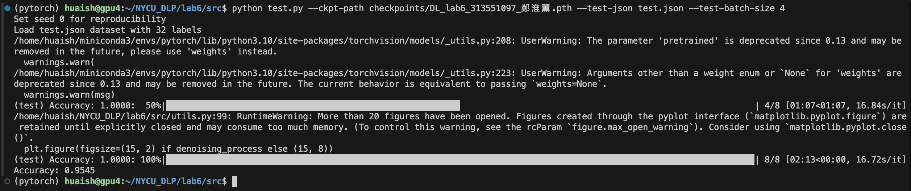

# Lab6 - Generative Models

> student id: 313551097  
> student name: 鄭淮薰

# Report

## Introduction

## Implementation details

### Model
### Noise schedule
### Dataloader
### Training
### Inference

## Results and discussion
### Synthetic image grids
### Denoising process image
### Extra implementations or experiments
---

# Experimental results

## Accuracy screenshots

### test.json

### new_test.json

## The command for inference process for both testing data

### Environment Setup

You can use either `conda` or `pip` to install the required packages.

### test.json

### new_test.json
